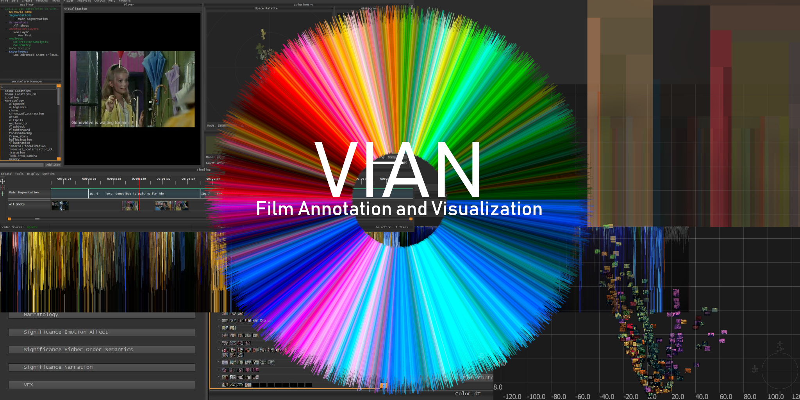

# VIAN - Visual Film Annotation (Beta)



Welcome to the repo of VIAN, software package for annotating, analysing and 
visualizing color in film. 

### Prerequisites
- Download and install [Anaconda](https://www.anaconda.com/distribution/)

---

***Note***

    You can also install VIAN with a another python 3 distribution than anaconda, however
    this is not tested yet, so no guarantees. 
    
---


```conda env create -f requirements.yml```


### Setting up the development environment
1. Clone this repository on your computer
2. Download the models from [OneDrive](https://1drv.ms/f/s!Avol1nnS24kLldQ6sI0KucWUrWWF6g) and copy it into the VIAN/data directory
3. cd to the root of the VIAN directory

    ```cd path/to/my/VIAN/```

4. Install the corresponding environment:

First we run the build.py file to setup the directory.

```python build.py```

<b>macOS:</b>
```conda env create -f environment_macos.yml``` 

<b>Windows:</b>
```conda env create -f environment.yml``` 

After the installation is complete, you can start VIAN by activating the new environment
and run main.py

<b>macOS:</b>
````
conda activate vian-osx
python main.py
````

<b>Windows:</b>
````
conda activate vian-win
python main.py
````

