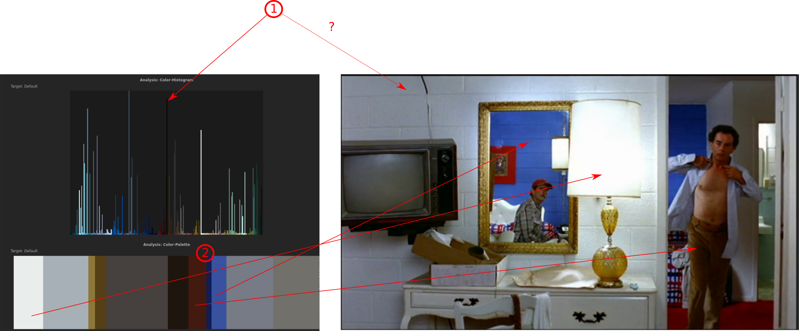
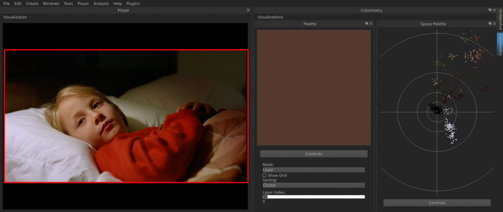

==============
Color Concepts
==============

In this section, you find an overview over the concepts, that are being used in
VIAN, and what you can read out of the various analyses that VIAN offers.

First of all, it is important to note that all of VIAN's visualizations of
color properties and analyses are in the CIE L*a*b*- (or, simply, Lab-) space.
Sometimes, elements or color properties of them are mapped into a sub-space of
CIE L*a*b* - e.g. in some visualizations, the average color of screenshots may
be displayed on the 2D-plane of their ab-values.

But let's first look at what the CIE L*a*b* space actually is:

CIE L*a*b*
**********

The CIE L*a*b* color space is a way to arrange colors in a intuitively
understandable way:
The three letters **L**, **a**, and **b** stand for the three parameters according to
which the colors are arranged in this color space:

- **L**: The Lightness of the color. The lighter the color, the higher is this
  value. It ranges from 0 (black) to 100 (white).
- **a**: The color on the green-red axis.
- **b**: The color on the blue-yellow axis.

Normally, the **a** and **b** values are mapped into a 2D plane, while the
**L** value is conceptualized orthogonal to this ab-plane. The result is a
spherical color space, in which each color can be distinctly described and
placed according to its **L**, **a**, and **b** parameters.

On the circular **ab**-plane, there are two further metrics, which are often used
in describing colors:

- **Hue**: The angle on the circle identifies, which color one is talking
  about, where a hue of value 0 corresponds to red. Notice, that after 1 turn
  we are at 0 again (This is why very small and very high hues represent
  similar colors. See below). (The scale starts at 0°, red, and ends at 360°,
  red again)
- **Chroma**: The chroma indicates how «greyish» a color is, the nearer to the
  circle center, the greyer the color. (A value of 0 indicates as grey as
  possible and a value of 100 as saturated as possible)

   The a*b*-plane. Credits: A Guide to Understanding Color [#]_.

.. figure:: CIE_Lab.jpg
   :scale: 60%
   :align: center
   :alt: map to buried treasure

   The CIE L*a*b* color space, modelled as sphere. Credits: Ly et al. (2020) [#]_.

However, this is an abstraction, or rather idealization of the actual color
space. The colors that can actually be perceived by the human eye form not a perfect
sphere, but rather a squished body, which is referred to as «gamut». In the
figure below, a representation of it can be seen. For simplicity however, it is
enough to remember the CIE L*a*b* color space as sphere, with the a* and b*
axis on its great circle which stands orthogonal to the luminance axis.

   The CIE L*a*b* gamut. Credits: Hoffmann (2003) [#]_.

An important property of the CIE L*a*b* space is that it is a so called
«perceptually uniform» representation of colors:
If we were to add a certain amount of lightness to two different colors, the
modelling in CIE L*a*b* would ensure that both resulting colors will end up in
a similar place relevant to their original ones.

Visualizations of VIAN Analyses
*******************************

In VIAN, color properties of entities (Screenshots, Segments, etc.) can be
calculated regarding different aspects:

- **Color Average** computes the average color of the whole entity
- **Color Histogram** computes the distribution of colors in the entity,
  without providing information as how to these colors are grouped
- **Color Palette** computes the distribution of colors in the entity, with
  providing information as how to these colors are grouped
- **Color Z-Projection** does not compute any color features, but it lays the
  frames of a Segment onto each other - so movement of foreground in contrast
  to the background are bettervisible

-------------
Color Average
-------------

Let's say you have several screenshots you want to analyse in your project.
You would follow the steps described in the section ref:`analyses`, so VIAN
computes the analysis you want it to, in this case **color average**.
When the computation has finished, VIAN offers you several visualizations of
these analyses.
The first you see in the analyses widget is the **AB-Plane**, which refers to
the a*b* dimension of the CIE L*a*b* color space.

In the figure below, you see every screenshot mapped onto its position in the
a*b* plane regarding the values of its average color:

   Color average analysed screenshots, mapped onto the a*b* plane.

You can imagine it as looking from the top (from the «northpole») of the color
globe from the figure before onto the middle plane, where the colors are mapped
according to their green-red and yellow-blue properties.

.. figure:: analyses_colordT_saturation.png
   :scale: 60%
   :align: center
   :alt: map to buried treasure

   Color average analysed screenshots, mapped regarding their saturation values
   over time.

In the drop-down menu, you can select different features of the color average
you want to plot over time.
For example, you can plot the hue on the y-axis over time on the x-axis.
However, since hue is conceptualized as laying in a circle, values with a very
high and with a very low hue value actually lie close together.
Due to the plotting of the hue value on a linear axis, this is not conceivable
on the first look:
The two screenshots marked with red arrows in the following picture are very
far away from each other concerning their x-axis value, but actually they are
almost the same color, since a very high and a very low hue value represent
very similar colors.

   Color average analysed screenshots, mapped regarding their hue values
   over time.

To inspect the **color average** analysis for single entities, in this case a
single screenshot, open the inspector and select the screenshot you are
interested in (either through the :ref:`outliner` or in the
:ref:`screenshot_manager`).
As you can see in the figure below, **1** points to the selected screenshot in
the screenshot manager and the inspector.
Just below the screenshot in the inspector, where **2** is pointing to, you see
the computed results of the color average analysis:
On th eone hand, you see the actual average color of the entity, as well as
the actual numerical values of that average color in different color schemes.

   The color average analysis in the Inspector.

---------------
Color Histogram
---------------

A Histogram is essentially a representation of the distribution of numerical
data --- in terms of colors of a digital image, this simply means to look at
each pixel individually and look at its color properties.
The accumulation of this process can then be visualized in a color space.

Consider an image like the following screenshot:

   A bright screenshot.

When the **Color Histogram** analysis has been computed of this image, you can
find a visualization of it in the inspector widget, below the actual image:

.. figure:: histogram.png
   :scale: 80%
   :align: center
   :alt: map to buried treasure

   Color Histogram of a bright screenshot, visualized in the Inspector.

As can be seen in the Histogram (and the screenshot as well, in this case),
there are many pixels that have yellowish color properties --- in this picture
those come from mainly from the sand in the background --- and there are also
spikes for pink and red color tons --- from the dress of the woman.
However, it has to be noted, that this is strictly speaking not visible from
the Histogram itself, it merely tells us that there are many yellowish pixels
in the image, but it does not convey information as how these pixels are
arranged in the picture.
In fact ANY arrangement of the pixels in the original image (also completely
random ones) would have the same Histogram.

Therefore, the Histogram is not an analysis that conveys too much information
for color analysis.

-------------
Color Palette
-------------

The Color Palette is an analysis similar to the Histogram, but with one
addition, which makes it more informational for interpretation:
Instead of computing the color properties of each pixel, the Color Palette
groups pixels that lie besides each other and share color properties together,
to create so-called superpixels. Then it computes the color average of these
superpixels.
See the figure below to get an idea what superpixels look like.

.. figure:: superpixels.png
   :scale: 60%
   :align: center
   :alt: map to buried treasure

   Superpixels visualized. Credits: Halter et al. (2019) [#]_.

In contrast to the before described Histogram, the Palette reveals information
about the distribution of the colors in the original image:
Since the algorithm clusters adjoining pixels together, and computes the
average color of those, you automatically know that if there is a large cluster in
the Histogram, there is also a large amount of adjoining pixels in the original
image, that share that average color.

   Differences between Histogram and Palette, examples of indicative Palette
   patterns marked.

In the figure above, for example, you have a big spike in black pixels in the
Histogram (marked with **1**). However, this does not indicate there is a
fairly large pixel area in the original image - in this case, there are rather
some small black pixel areas (cupboard handles, right side of the TV, hair of
the man etc.) which accumulated lead to the overall spike of black pixels in
the Histogram.
For the Palette, in contrast, there are clear correspondences for large Palette
color areas in the original image (marked with the arrows under **2**).

   The 3D Visualization of superpixels of some Screenshots.

In fact, if you run the **Colorimetry**, this is what happens in the background
for each frame in the movie.

In the Colorimetry widget, you can actually
control the size of the superpixels: The Slider *Layer Index* lets you define
how many splits in superpixels you want in your image. If you set this value to
zero splits, i.e. one superpixel, what you actually compute is the **Color
Average** since the whole image is now the superpixel. If you increase the
value to one, i.e. two superpixels, the image is divided into two superpixels
so that both are as coherent as possible. If you increase to two, the process
continues. Below, there is an example, where you can see on the player the very
vaguely approximated superpixels and in the Palette widget their mean hues.

   Palette with increasing superpixels, superpixels are approximated on the
   left.

------------------
Color Z-Projection
------------------

The Z-Projection differs from the other color analysis in that it does not
compute any features. It simply lays all the frames in a temporal entity, i.e.
a Segment, on top of each other. This allows you to see where movement in a
segment happens. However, if there are cuts or camera movements in the Segment,
the Z-Projection will, of course, only produce some blurred image. See an
example below: The background stays stable, while the two figures in the
foreground are blurred, which means they move during the analyzed Segment

   Result of a Z-Projection, visualized in the Inspector on the right side.
   left.

****

Links & References
******************

For more information on CIE L*a*b*, see for example this  article in `Wikipedia
<https://en.wikipedia.org/wiki/CIELAB_color_space>`_.

Excellent explanation of core concepts, such as hue, saturation, brighness, etc.
on `Youtube
<https://www.youtube.com/watch?v=0IIb0tnLIcU>`_.

Short but insightful explanations of a lot of `color terms
<http://changingminds.org/explanations/perception/visual/lightness_variants.htm>`_.

Further readings:

- `Halter, Gaudenz; Ballester-Ripoll, Rafael; Flueckiger, Barbara; Pajarola, Renato (2019): VIAN. A Visual Annotation Tool for Film Analysis.  In: Computer Graphics Forum, 38,1.
  <https://onlinelibrary.wiley.com/doi/full/10.1111/cgf.13676>`_.

.. [#]
https://www.xrite.com/-/media/xrite/files/whitepaper_pdfs/l10-001_a_guide_to_understanding_color_communication/l10-001_understand_color_en.pdf

.. [#] Ly, Bao & Dyer, Ethan & Feig, Jessica & Chien, Anna & Bino, Sandra. (2020). Research Techniques Made Simple: Cutaneous Colorimetry: A Reliable Technique for Objective Skin Color Measurement. The Journal of investigative dermatology. 140. 3-12.e1. 10.1016/j.jid.2019.11.003.

.. [#] Hoffmann, G. (2003). Cielab color space. Wikipedia, the free encyclopedia. mht.

.. [#] Halter, Gaudenz; Ballester-Ripoll, Rafael; Flueckiger, Barbara; Pajarola, Renato (2019): VIAN. A Visual Annotation Tool for Film Analysis. In: Computer Graphics Forum, 38,1.

.. toctree::
    :maxdepth: 4

