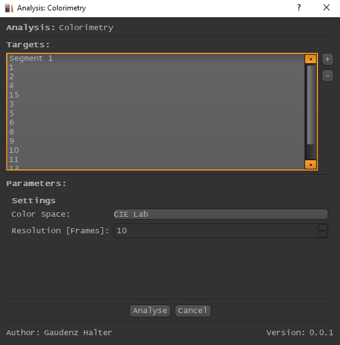

.. _IAnalysisJob:

.. toctree::
   :maxdepth: 4

   analyses/color_features

IAnalysisJob
============
To implement your own Analysis, subclass the IAnalysisJob Interface and add your class into the
*extension/analysis/your_package/* folder.
Your analysis will then automatically appear in the Analysis/Extensions Menu of the MainWindow.

Functionality
*************
Once the user has triggered the Button in the MainWindow menu, following process will take place:

**Analysis**

1. A Dialog Appears where the user can select all targets and additional Parameters defined by your function.

2. On Accept, the analysis will take place as follows:

3.1 **IAnalysisJob.prepare()** will be performed, where you will pack all information needed into a list.

3.2 **IAnalysisJob.process()** will be performed in an external Thread. All information packed in the last step will be available for you, and no more!

3.3 **IAnalysisJob.modify_project()** Once the process() function has finished the Thread will be destroyed and the your result will be sent back to the Main-Thread into the IAnalysisJob.modify_project() function. Here you can perform any modifications to the Project if necessary.

4. You Analysis will be stored in the Project

**Visualization**

If the user triggers the Visualization, a new QMainWindow or a Webbrower will be opened and all results of your analysis will be
handed to the widget, or url in case of a webbrowser.

   The AnalysisDialog, note the Widget beneath *Parameters* is returned by IAnalysisJob.get_parameter_widget()

**IAnalysisJob.get_preview()**

.. figure:: analysis_preview.png
   :scale: 100 %
   :align: center
   :alt: map to buried treasure

   The Preview Widget as shown in the Inspector when an Analysis is selected. Here as a QWebView

..  autoclass:: core.data.interfaces.IAnalysisJob
    :members:

Example
*******
.. toctree::
   :maxdepth: 4

   analyses_example

* :ref:'_IAnalysisJobExample'

* :ref:`genindex`
* :ref:`modindex`
* :ref:`search`cd _docs