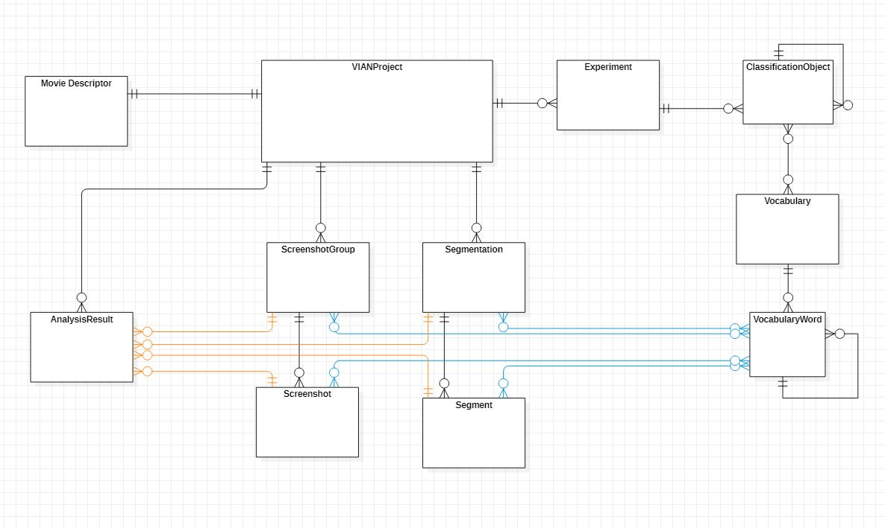

.. _Container_Package:

Container Package
*****************

Basic Structure
###############

Annotation Types
################

VIAN uses three annotation types currently:

1. Segment
2. Screenshot
3. (Visual) Annotations (kinda deprecated before final implementation ;-) )

Each of these are grouped in a specific group, and displayed in strips within VIAN

1. Segmentation
2. ScreenshotGroup
3. AnnotationLayer

.. toctree::
    :maxdepth: 4

    containers/project
    containers/annotation
    containers/screenshots
    containers/segmentation
    containers/media_objects
    containers/experiment
    containers/node_scripts
    containers/analysis
    containers/hdf5_manager

Example
*******
.. toctree::
   :maxdepth: 4

   analyses_example

* :ref:'_IAnalysisJobExample'

* :ref:`genindex`
* :ref:`modindex`
* :ref:`search`cd _docs