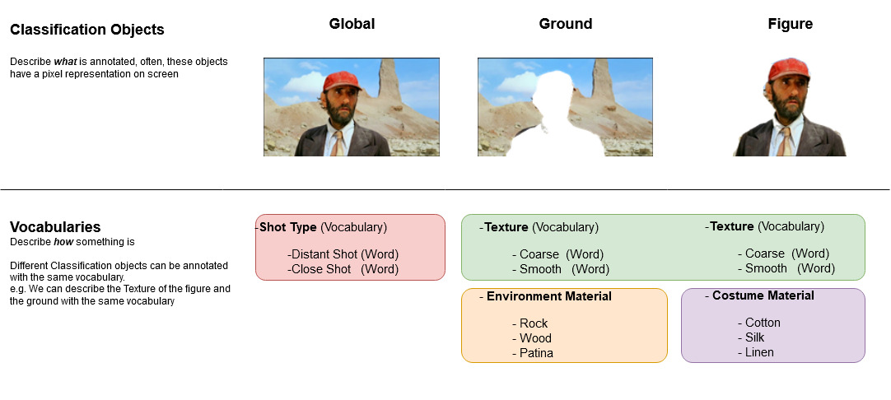

.. _primer:

======
Primer
======

In this section, the typical workflow of VIAN and concepts behind it shall be explained.

Creating a Project
==================

For each movie to analyse, you need to create a new project. Think of a project as a container which contains **1.** a movie, **2.** a corresponding experiment (objects and their vocabulary), **3.** all the annotations, segmentations, screenshots, analyses etc. which were / are to be performed on it.

The project ensures that you can close VIAN and continue to work on the project at another time, only having to load the project and having at hand the configuration and performed tasks.
You can specifiy the location of your projects, the default hereby is: */Documents/VIAN/projects*.

.. seealso::

   Video-Tutorials:

   * :ref:`create_new_project_no_autoname`
   * :ref:`create_new_project_with_autoname`

   Other Wiki-Pages:

   * :ref:`vian_projects`

Segmentation
============

Experiments
===========

Classification
==============

   The Player Persepctive.

Color Analysis
==============

.. toctree::
    :maxdepth: 2

* :ref:`genindex`
* :ref:`modindex`
* :ref:`search`
