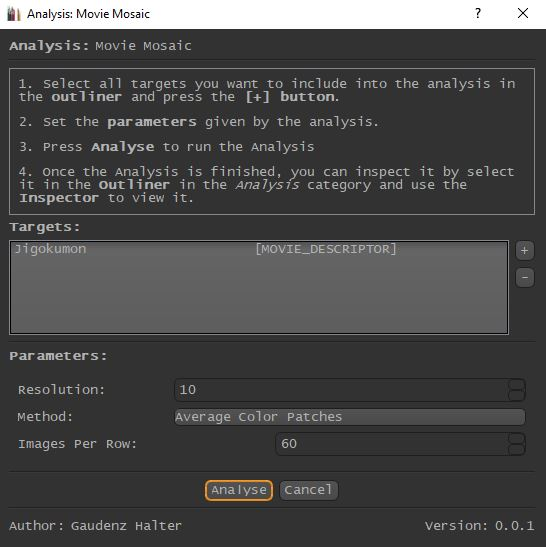

.. _running_analyses:

********************
All Analyses of VIAN
********************

To run an Analysis, do the following:

1. Make sure your **Outliner** is open, if it is not opened, use the **Alt + O** Hotkey.
2. Navigate to **Analysis/<Your_Analysis>
3. A new Dialog will appear called "Analysis: <Your Analysis>"
4. While keeping the Dialog open, select all Objects you want to perform you Analysis on in the **Outliner**
5. Set the Parameters according to your wishes.
6. Press **Analyse** to run the Analysis.

.. note::
   Alternatively, one can select all targets *before* opening the Analysis Dialog. These will automatically be added.

   The Analysis Dialog as it appears when running a Mosaic Plot Analysis.

.. seealso::

   * :ref:`analyses`
   * :ref:`viewing_analyses`
   * :ref:`viewing_analyses`

* :ref:`genindex`
* :ref:`modindex`
* :ref:`search`

