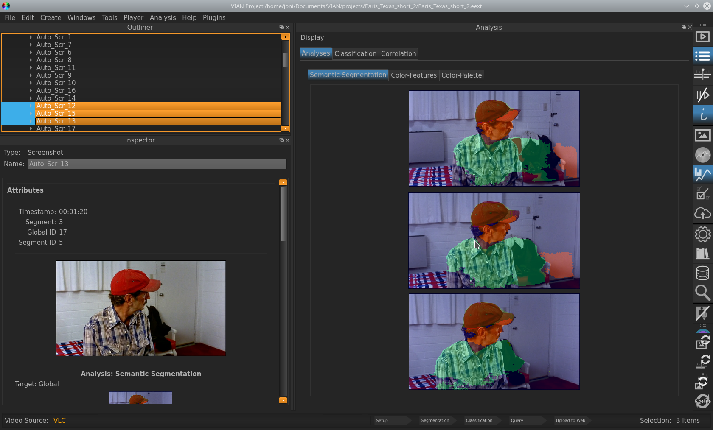

.. _viewing_analyses:

****************
Viewing Analyses
****************

If your Analysis has finished, you can inspect it as follows:

1. Make sure you have opened the relevant Windows for viewing analyses results, i.e. the :ref:`outliner`, :ref:`inspector` and the :ref:`analyses` window. Using the Hotkey **Alt + 6** will automatically select these.
2. In the Outliner on the Left, under the *Analyses* Category select your Analysis.
3. In the Analysis Results Widget on the Right, your Analysis should appear.
4. Use **Display/Fullscreen** in the Analysis Results Window to look at the Visualization in Fullscreen

   The Analysis Result Display. Notice that you can select multiple Entities to view their analyses simultaneously.

.. seealso::

   * :ref:`analyses`
   * :ref:`running_analyses`
   * :ref:`analyses_list`

* :ref:`genindex`
* :ref:`modindex`
* :ref:`search`

