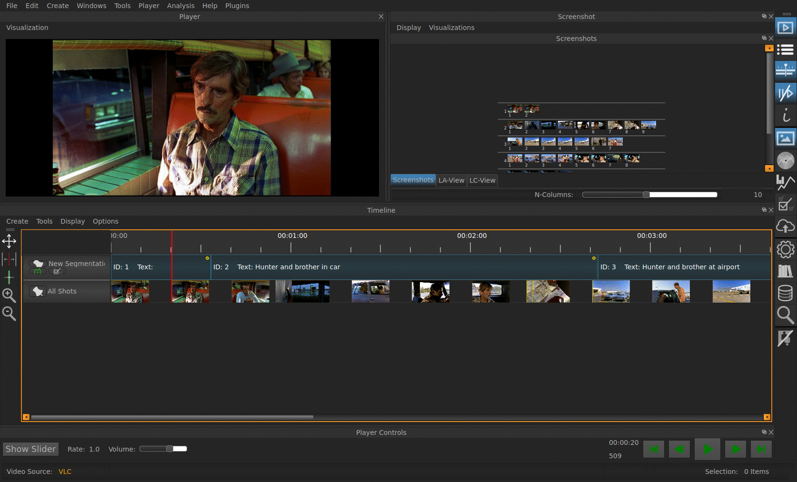

.. _classification:

Classification
==============

Classification of entities in one's film is often a core task in many
projects. To perform a classification, you need to have the following
steps accomplished:

- Created the entities on which you want to perform a classification (:ref:`segmentation`, :ref:`screenshots`).
- Created/Loaded the :ref:`_vocabulary` with which you want to classify.

When the above listed steps have been performed, you are ready to carry
out a classification. To do so, VIAN offers two ways, in which this can
be done:

**1. Using the Classification Widget**

The regular :ref:`classification widget` offers different modi on how you want
to step through your movie (sequentially, only considering one entity,
etc.). This is the standard way of doing classification in VIAN.

This approach is recommended if you:

- Only want to classify certain entities in your project, instead of all. (For example, you might only be interested in one particular scene of the movie.)
- Your entities include Screenshots.

**2. Classifying directly in the Timeline** 

The other way is to classify directly in the :ref:`_timeline`:

If you click on the *checked Box* icon in the Segmentation Layer you
want to annotate, the vocabularies are being expanded below it.
To toggle the Segmentation Layer, click the *lock* icon - this is
especially useful, if your vocabulary is large, and/or you want to rely
on annotation information which is visible in the Segmentation.
For annotating a Segment with a certain key-word, identify the keyword
in the expanded vocabulary tree and simply click on the corresponding
Segment.

This approach is recommended if you:

- Want to quickly annotate contiguous Segments
- Stay in the Timeline (i.e. not change to a different widget)
- Do not want to annotate Screenshots (for the moment)

   The Mask before starting a Classification.

.. toctree::
   :maxdepth: 4

