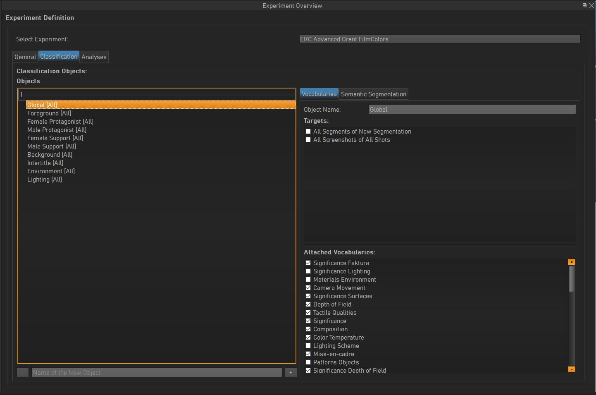

********************
Creating Experiments
********************
.. _creating_experiments:

To create a new Experiment, do the following:

    1. Go to **Create/Create Experiment**.
    2. Open the experiment editor either by clicking |icon_experiment_editor| in the toolbar, or via **Windows/Experiment Editor**.
    3. Open the outliner by either clicking |icon_outliner| in the toolbar, **Alt + O** or via **Windows/Outliner**.
    4. In the outliner select the new experiment.
    5. In the experiment editor open the **General** tab to rename the experiment to your needs.

***********************
Configuring Experiments
***********************
.. _configuring_experiments:

Setting up an experiment can feel a bit complicated at the beginning, but will become more intuitive once you understood,
VIAN's way of looking at things.

Once you have configured your experiment as described in :ref:`_creating_experiments` you can edit the experiment
in the experiment editor. You should now see this widget:

To add classification objects, do the following:

    1. Open the experiment editor either by clicking |icon_experiment_editor| in the toolbar, or via **Windows/Experiment Editor**.
    2. In the **Classification** tab, add a classification object by typing its name into the textbox on the bottom.
    3. On the right side, select the **Vocabularies** tab.
    4. In **Attached Vocabularies** tick all vocabularies with which you want to classify the created classification object.

.. note:: **Classification Objects**
    A classification object may be both a conceptual or true object which you want to classify, and may have a pixel
    representation within the film material. E.g. A classification object could be named *Figure* or *Ground*,
    since only the *Figure* can have an emotional state, the vocabulary *Emotion* would only be used to classify *Figure*.
    A conceptual classification object could for example be *Soundtrack*.

.. |icon_experiment_editor| image:: ../../../../qt_ui/icons/icon_settings_plot.png
   :height: 20px
   :width: 20px

.. |icon_outliner| image:: ../../../../qt_ui/icons/icon_outliner.png
   :height: 20px
   :width: 20px

.. seealso::

   * :ref:`new_project`
   * :ref:`import_elan_projects`
   * :ref:`changing_movie_paths`

* :ref:`genindex`
* :ref:`modindex`
* :ref:`search`

