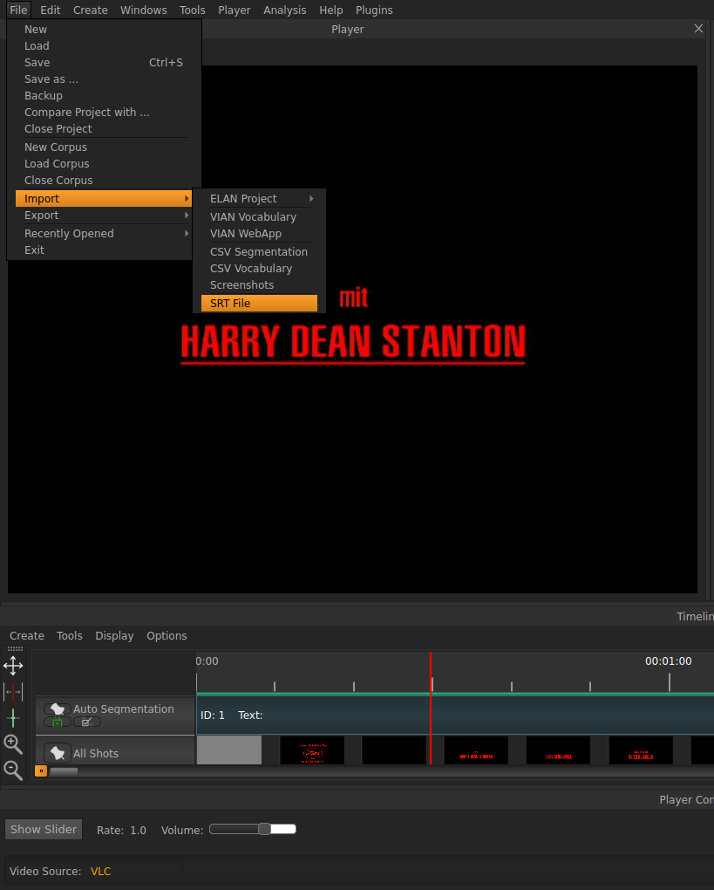
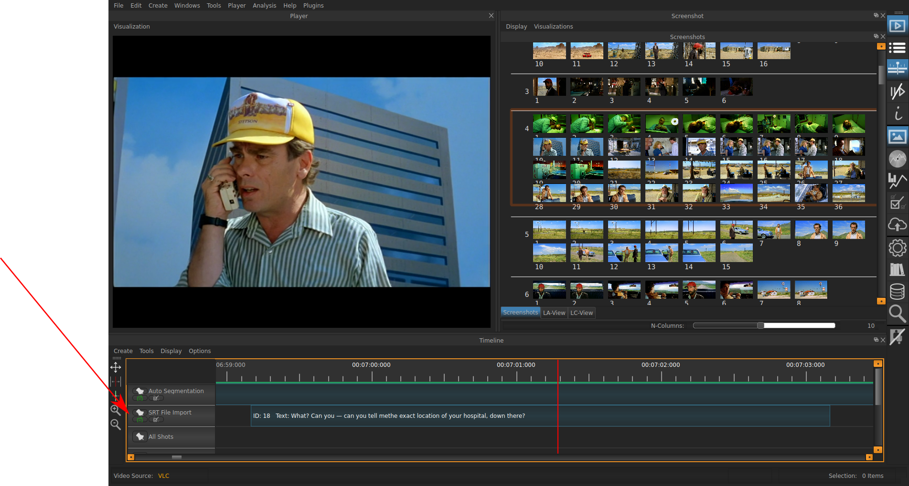

.. _change_subtitles:

Changing Subtitles
******************

If you have subtitles for a movie and you want to include them in your
project, you can import them with the following command:
Change the Subtitles as follows:

Select subtitles (.rst) file under File >> Import >> SRT File 

The subtitles will be imported as a sort of segmentation Layer in the Player.
The time spans in which there is speech are Segments with the subtitles as text
in them.

.. seealso::

   * :ref:`player`
   * :ref:`Video Player`

* :ref:`genindex`
* :ref:`modindex`
* :ref:`search`
