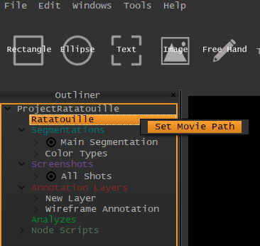

.. _changing_movie_paths:

Changing Movie Paths
********************
There might be occasions where changing the movie path becomes necessary.
For example, when the project has been moved to a different computer and the movie file
is located at a different location, or when the movie file has been changed.

1. In the Outliner, *Right-Click* on the **movie-descriptor** (Indicated with a yellow color).
2. In the appearing ContextMenu, click on **Set Movie Path** and choose the target movie file.

.. note:: **Options**
   1. Some **Option**

   The VIAN Project Dialog

.. seealso::

   * :ref:`new_project`
   * :ref:`project_templates`
   * :ref:`import_elan_projects`
   * :ref:`outliner`

* :ref:`genindex`
* :ref:`modindex`
* :ref:`search`