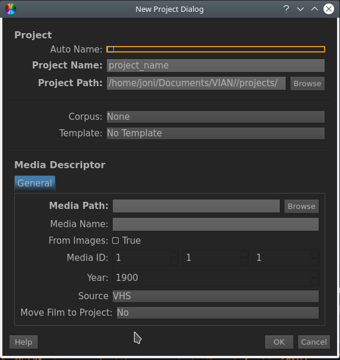

.. _new_project:

Creating new Project
********************

Creating a new VIAN Project as follows:

1. Go to File/New Project
2. The "New Project Dialog" appears
3. Fill out the Form

.. note:: **Options**

   1. **General**

      1. **Project Name** refers to the Name assigned in the Outliner.
      2. **Project Path** use "Browse" to find a valid save path or insert one into the Text Box. The default path points to the project-directory in the VIAN-directory.
   2. **Template**

      1. If intended, select a  **Template** from the DropDown menu. This Template will support you with its Vocabulary - often it is more convenient to adapt a existing Vocabulary to one's own needs than to build one from «scratch».

   3. **Media Descriptor**

      1. Choose an appropriate **Media Name**.
      2. Select the **Media Path**, where your target Movie is located.
      3. If intended, assign a **Media ID** to your Movie
      4. Assign a **Year** to the Movie
      5. Select a **Source**

   The "New Project Dialog" of VIAN.

.. seealso::

   * :ref:`project_templates`
   * :ref:`import_elan_projects`
   * :ref:`changing_movie_paths`

* :ref:`genindex`
* :ref:`modindex`
* :ref:`search`
