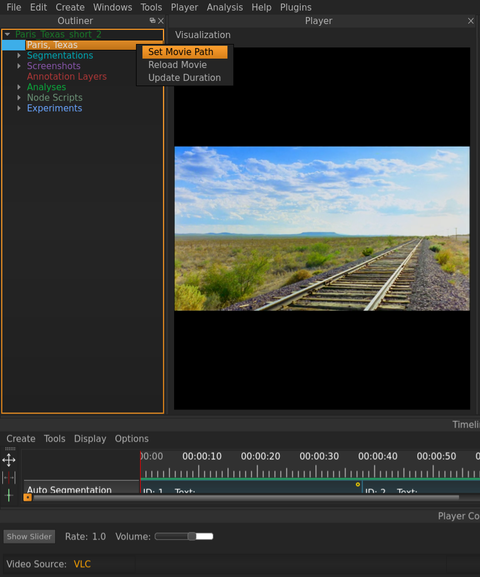

.. _import_elan_projects:

Importing ELAN Projects
***********************
VIAN has historically been designed to be able to handle ELAN Project.
To import an existing ELAN Project, do the following:

1. Go to File/Import/ELAN Project.
2. Select the target Project in the File Dialog.
3. After the Import has finished, right click to the MovieDescriptor Item in the *Outliner*.
4. Click on *Set Movie Path* and choose the target Movie in the File Dialog.

.. seealso::

   * :ref:`new_project`
   * :ref:`project_templates`
   * :ref:`changing_movie_paths`
   * :ref:`outliner`

* :ref:`genindex`
* :ref:`modindex`
* :ref:`search`
