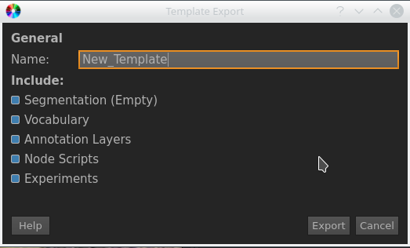

.. _project_templates:

Project Templates
*****************

Templates give you the ability to keep specific setups between multiple projects.
A Template stores the empty Segmentation, Annotation Layers, Vocabularies and Node Scripts,
and can be imported on project creation.

1. Go to File/Export/Project Template.
2. The Export Project Template Dialog should appear.
3. Fill out the Form.
4. Click on Export to finish the process.

.. note:: **Options**

   1. **Name**, how the template should appear in the "New Project Dialog"
   2. **Include**, which entities of your project should be exported.

   The Export Template Dialog

.. seealso::

   * :ref:`new_project`
   * :ref:`import_elan_projects`
   * :ref:`changing_movie_paths`

* :ref:`genindex`
* :ref:`modindex`
* :ref:`search`