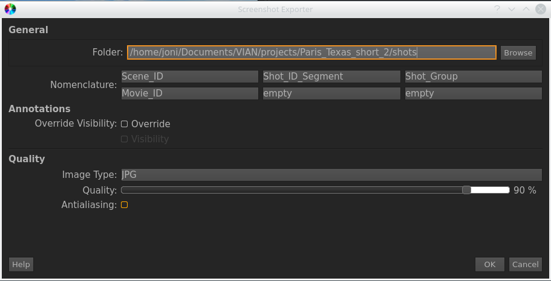

.. _export_screenshot:

Exporting Screenshots
*********************

Creating a new VIAN Project as follows:

1. **Select** all Screenshots you want to export, (Or None if you want to export All)
2. In the Screenshot Toolbar, select **Export Screenshots**
3. Fill out the Form

.. note:: **Options**

   1. **Folder** The Folder the Screenshots are exported to.
   2. **Nomenclature** Use the Drop-down menus to define a nomenclature.
   3. **Override Visibility** By default, the Screenshots are exported as shown in the Screenshot Manager.
      Thus, Screenshots with the Annotation visible will be exported with Annotations. Check this,
      if you want to set the Annotation Visibility for all exported Screenshots. Use the **Visibility** Checkbox to
      control whether the Annotations should be exported or not.
   4. **Image Type** Specifies the Image Format. (Either .png or .jpg)
   5. **Quality** IN JPG Images, the quality refers to the export quality of the images. Higher quality leads to larger size.
      In PNG Images, Quality refers to the compression level of the Images.

   The *Screenshot Exporter" Dialog

.. seealso::

   * :ref:`create_screenshot`

* :ref:`genindex`
* :ref:`modindex`
* :ref:`search`