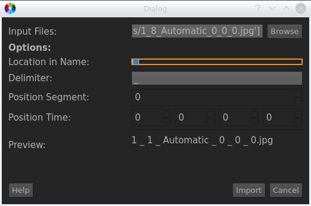

.. _import_screenshots:

Importing Screenshots
*********************

There might be the situation, where you want to import a set of given images
into a VIAN Project.

**Background**
Since VIAN does not store the actual images when taking a Screenshot, but rather their frame position
and uses these for a variety of reasons. VIAN needs to determine the actual location of the Screenshot within the
Movie. This mean, that for each Screenshot to import, the most matching Frame within a Movie has to be found.

While it is possible to import hundreds of Screenshots without any information into VIAN. The computation time is much
better if there is some hint about the location of the screenshot in the file-name.

To import a set of Screnshots do the following

1. Go to **File / Import / Screnshots**.
2. A new Dialog will appear.

.. note:: **Options**

   1. **Files** The Screenshot files you want to import, select them by using **Browse**.
   2. **Location in Name** if the file-names contain information about the location of the Screenshot within the movie
   3. **Delimiter** The Delimiter that is used in the File-Names to seperate information
   4. **Position Segment** The Index Position of the Segment-ID the Screenshot is within. (Keep at -1 if this is not given)
   5. **Position Time** The Index Position of the Time Values within the File Names. (H:M:S:MS)

.. note:: **Example**

   Given a list of Screenshots with following naming convention:

    **00_30_10.jpg** where the convention is : **hh_mm_ss.jpg**, one would set the **Delimiter** to "_",
    activate **Location in Name** and set the **Position Time** Fields to: 1 , 2 , 3, -1 since Milliseconds are missing.

    Another Example:
    **ScreenshotInSegment01.jpg** one would set the **Delimiter** to "InSegment",
    activate **Location in Name** and set the **Position Segment** to 2.

.. seealso::

   * :ref:`project_templates`
   * :ref:`import_elan_projects`
   * :ref:`changing_movie_paths`

* :ref:`genindex`
* :ref:`modindex`
* :ref:`search`
