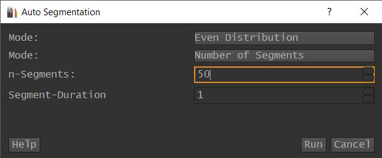
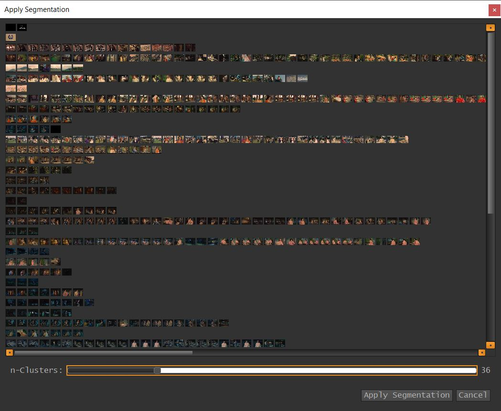

.. _auto_segmentation:

Auto Segmentation
*****************

.. note:: **Colormetry**
   Auto Segmentation depends on the **Colormetry** Analysis, which has to be run and finished before
   the Auto Segmentation can be used. The Auto Segmentation Dialog will inform you about this and gives
   you the Option to run it.

VIAN allows you to automatically create Segmentations based on either even distribution or Color-Histograms.
To create a Segmentation automatically, do the following:

   1. Go to **Tools/Auto Segmentation**.
   2. A new **Auto Segmentation Dialog** appears.
   3. **Fill out** the Form.
   4. Press **Run** to start the computation.

   5. If you have chosen Color-Histogram a batch-process starts running and a new Dialog will open as soon as VIAN has finished computing.
   6. In the **Auto Segmentation Result** Dialog, use the slider to check the different Segmentations.
   7. Use **Apply Segmentation** to create a Segmentation, the Dialog will stay open, so you can create several Segmentations.

.. note:: **Options**

   1. **General**

      * **Mode** Select the Method to create the Segmentation.

   2. **Mode: Even Distribution**

      * **Mode** This can either be **Number of Segments**, you then have to fill in the **n-Segments**
      Parameter with the number of Segments you want to create, or **Segment Length**. In the later case you have to set
      the **Segment Length** Parameter to the Length of each Segment in *Frames*.

   3. **Mode: Color Histogram**

      * **Display every n-th Frame** is only a cosmetic Parameter, it defines how many frames should be displayed as preview in the Result Dialog
         and will only affect the performance of the Result Dialog. As such VIANs Colormetry is calculated every 30th Frame. Setting this value to 10
         would show every 300 Frame of a movie in the Result Dialog.
      * **Cluster Range** controls how many different clusterings should be produced to later select from. While one can calculate a huge number of clusterings.
         it is good practice to give a "Good Guess" on how many Segments one would expect, reducing the computation time.
         i.e. Taking 30 to 60 Clusters gives results later in Segmentations with 30 up to 60 Segments from which can be chosen.

.. figure:: auto_segmentation_hist.jpg
   :scale: 80 %
   :align: center
   :alt: map to buried treasure

.. seealso::

   * :ref:`new_project`
   * :ref:`import_elan_projects`
   * :ref:`changing_movie_paths`

* :ref:`genindex`
* :ref:`modindex`
* :ref:`search`