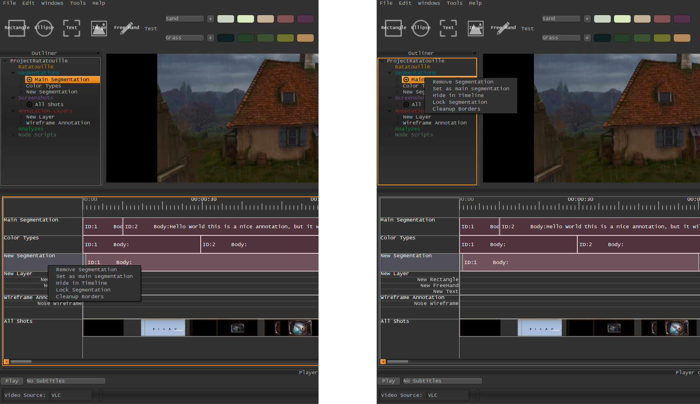

.. _changing_main_segmentation:

Changing the Main Segmentation
******************************

To change the Main Segmentation, do one of the following:

1. In the Timeline:

   1. **Right-Click** onto the name of the Segmentation which should be the new *Main-Segmentation*
   2. Choose **Set as Main Segmentation**

1. In the Outliner:

   1. **Right-Click** onto the name of the Segmentation which should be the new *Main-Segmentation*
   2. Choose **Set as Main Segmentation**

.. seealso::

   * :ref:`new_project`
   * :ref:`import_elan_projects`
   * :ref:`changing_movie_paths`

* :ref:`genindex`
* :ref:`modindex`
* :ref:`search`