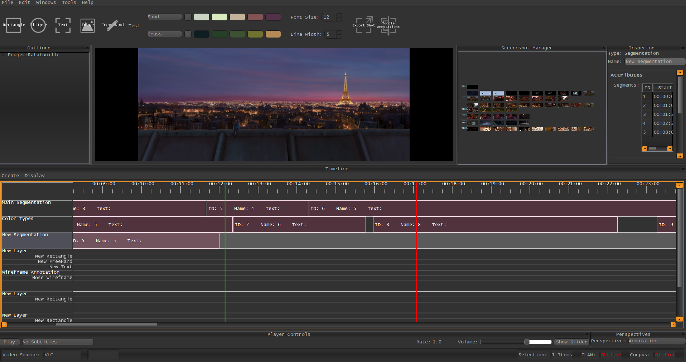

.. _create_segment:

*****************
Creating Segments
*****************

There are several ways to create Segments in VIAN, depending on your Use-Case you may choose one of the following:

1. **Time Slice Dragging** allows you to define a start and an end-point of the new segment.
2. **Fast Segmentation** will automatically create a new Segment from the last segments end, to your current time location.
3. **Interval Selection** allows to define a start and an end-point with an infinite number of actions in between.

Time Slice Dragging
*******************

1. In the Timeline, **click** on the name of the Segmentation you want to add a Segment to.
2. The Segmentation should now be highlighted with a steel-blue color.
3. On the *Timeline-Scale*, **Right-Press** and drag (while holding the the Right Button down) from the segment start to the Segment end and **Release**.
4. In the appearing Context Menu, choose **Add Segment**.

.. note:: **Options**

   1. **Name**, how the template should appear in the "New Project Dialog"
   2. **Include**, which entities of your project should be exported.

.. figure:: create_segment_01.png
   :scale: 80 %
   :align: center
   :alt: map to buried treasure

   The Export Template Dialog

Fast Segmentation
*****************

1. In the Timeline, **click** on the name of the Segmentation you want to add a Segment to.
2. The Segmentation should now be highlighted with a steel-blue color.
3. On the *Timeline-Scale*, **Right-Click** onto the end Position of your new Segment.
4. In the appearing Context Menu, choose **New Segment**.

.. note::
   Alternatively, one can create a new Segment using the Main Menu by triggering:

   **Create/Add Segment**

.. note::
   **Forward vs. Backward Segmentation**
   By default, VIAN uses a **Backward Segmentation** algorithm when fast-segmenting.
   This means, that the new segment is created from the last Segment's end to the current time.

   Alternatively, you may activate **Forward Segmentation** in the *Timeline/Options* Menu, this means,
   that the new segment is created from the current time to the next Segment's start or the end of the movie,
   cutting the overlapping Segment if existing.

.. figure:: create_segment_02.png
   :scale: 80 %
   :align: center
   :alt: map to buried treasure

Interval Selection
******************

1. In the Timeline, **click** on the name of the Segmentation you want to add a Segment to.
2. The Segmentation should now be highlighted with a steel-blue color.
3. Navigate to the start point of your segment.
4. Press **Ctrl + W** to set a start-point. A new green line should appear.
5. Navigate to the end-point of your Segment.
6. Press **Ctrl + E** to finish up the new Segment

.. seealso::

   * :ref:`new_project`
   * :ref:`import_elan_projects`
   * :ref:`changing_movie_paths`

* :ref:`genindex`
* :ref:`modindex`
* :ref:`search`
