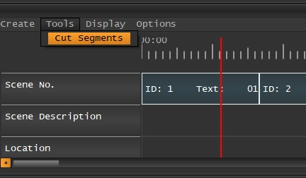

.. _cutting_segments:

****************
Cutting Segments
****************

To cut an existing Segment into two seperate Segments, do the following:

1. In the Timeline, navigate to **Tools/Cut Segments** or access it directly by the icon from the toolbar left of the Timeline.
2. With the Mouse, move hover over the Segment you want to cut at the location you want to cut it.
3. Press **Left Mouse Button** to cut the Segment.

.. seealso::

   * :ref:`new_project`
   * :ref:`import_elan_projects`
   * :ref:`changing_movie_paths`

* :ref:`genindex`
* :ref:`modindex`
* :ref:`search`
