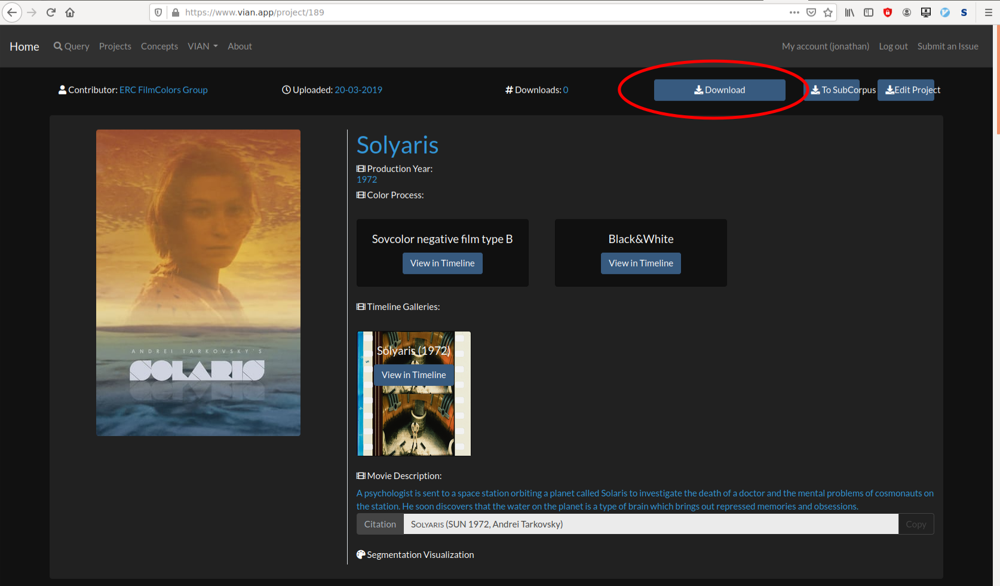
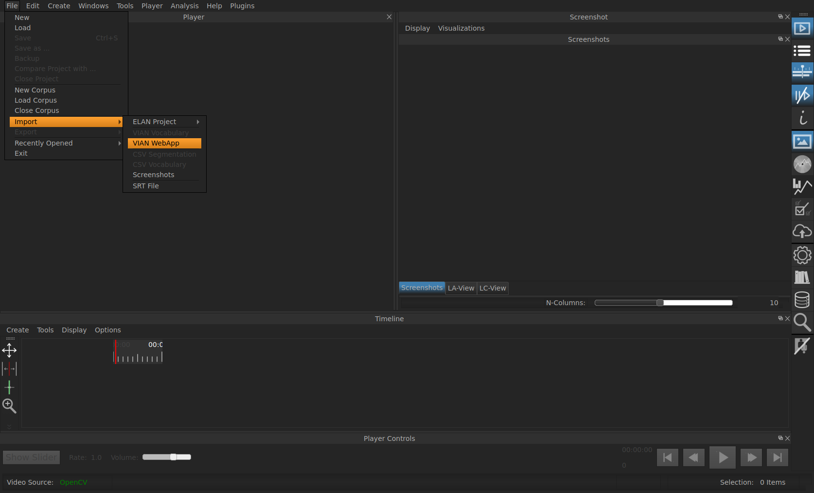

.. _vian_app_projects:

VIAN WebApp Projects
====================

On the home page of `VIAN <https://www.vian.app/projects>`_ you can
find a multitute of already analysed movies. Besides the possibility
to query and explore those on the site of VIAN directly, you can
also download a project you're interested in and look at it in the
VIAN application itself.

.. note::

   It is important that you are in possession of the **exact** same movie file - otherwise the project that will be re-built in your VIAN locally will be corrupted.

To inspect a project locally in your VIAN application, select the move
you are interested in and click `download`.

   The interface of a project in the VIAN WebApp.

In VIAN, go to `File` >> `Import` >> `VIAN WebAPP`. Chose the `.json`-File you downloaded.

   Importing a downloaded project in the local VIAN application.

After you specified the project file, VIAN asks you for two more specifications:

First, you need to specify the location where the project you are
about to import should be stored on your computer. Normally, this
would be the same directory where all your VIAN projects lie, by
default: `/<path>/<to>/VIAN/projects`. In most cases, you can
simply accept the default folder VIAN suggests to you.

Secondly, VIAN needs to know where the corresponding movie for the
project file lies. Due to propriety issues, the VIAN WebApp cannot
provide you the movie file with which the project was generated.
Therefore, you must obtain the correct movie file by yourself. Note
that it is well possible that even if you have the correct movie
that this file might still slightly differ from the file with which
the project was generated; in consequence, there might be small
incorrections like slightly offsetted screenshots and segmentations
and the like.

Using VIAN WebApp Projects locally
**********************************

* :ref:`genindex`
* :ref:`modindex`
* :ref:`search`
