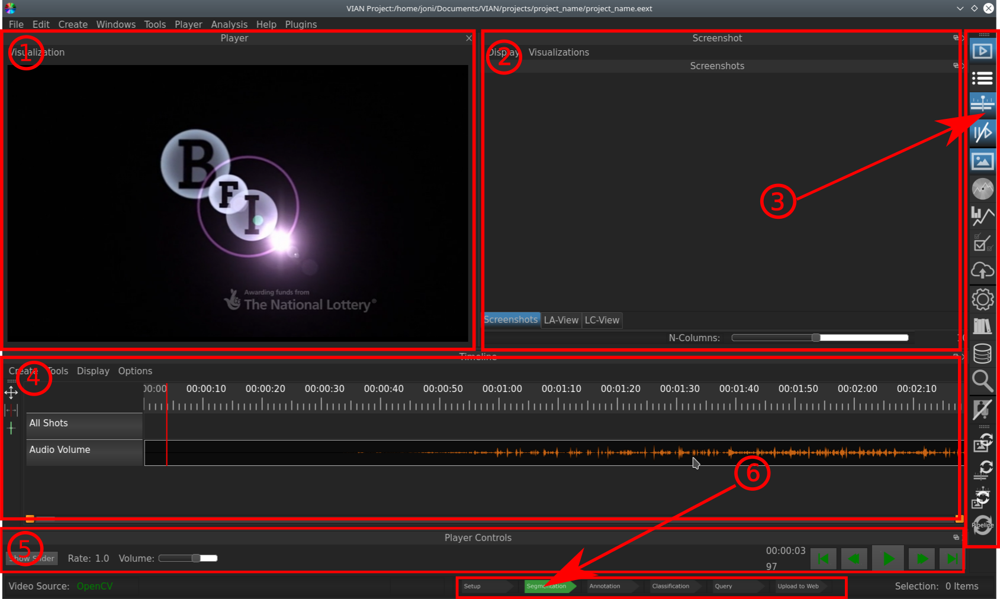

==================
Overview Interface
==================

After you've created a new project and opened the video file, your VIAN interface will look like the following picture:

   Overview of VIAN start window.

.. toctree::
   :maxdepth: 4

   OverviewInterface.rst

As you would perform different tasks in your annotating workflow, you would need different widgets and windows to complete them. The VIAN Interface is therefore designed to be as flexible as needed: Different widgets and windows can be closed and opened, re-arranged or even «popped-out» (by dragging the element by its titel bar) of the normal Interface.

.. Since this is what you will see when you create a new project, the Timeline and Screenshot Manager look (and are) pretty empty. If you want to know what a prototypical procedure in annotating and analyzing a film from this point on would look like, go to XXX. If you want to know more about a specific widget seen above, go to YYY.

1. Video Player
***************

The Video Player shows you the current frame where you are in the **Timeline**. It is also a **Perspective**.

2. Screenshot Manager
*********************

The Screenshot Manager let's you manage your screenshots and has several display possibilities of them: In the default view (when the **Screenshots** Tab is highlighted) the screenshots are displayed according to your main **Segmentation Layer**, which means that the Shots are being ordered according to the Segment in which they were taken. The **LA-View** and **LC-View** plot all Screenshots according to their color properties. With the **Plot Controls** you can scale the axes and icons. It is also a **Perspective**.

3. Control Panel
****************

The Control Panel allows you to configure the VIAN interface with the Windows and tools you need for your current task. It indicates active Windows by highlighting them blue. If you closed a window (by accident or because you didn't it for the moment) you can always get it back by clicking the corresponding icon in the control panel (if ou hover the icons, you will see what Window it stands for).

4. Timeline
***********

In the timeline you find a lot of useful information: You see an Overview of the different Layers your project has (Segmentation, Annotation), the Screenshots you took, the Luminance and Volume levels of the movie. The red line indicates where in the movie you are, as seen in the **Video Player**.

5. Player Controls
******************

The Player Controls is the tool for controling playing of the media, i. e. the movie you are annotating: You can regulate the Volume, play and pause the movie (which can also be done by hitting **Space**, fast for- and backward it, etc. The **Show Slider** Button lets you control by a slider, where in the movie you wanna be (the same funcionality as the red bar in the **Timeline**). Since this a Window that is not always needed, often you can close it to increase the size of other windows (e. g. the **Screenshot Manager** etc.).

6. Current Position in the Workflow
***********************************

In the prototypical case of annotating a movie, there is a series of tasks you have to do sequentially: Setting up the adjustments how and what you want to annotate (specifying for example a vocabulary and and objects you want to classify according to it) --> Split the movie in logically coherent Segemnts (for example according to color features) --> Annotate/Classify these segments (-->) Upload your annotated movie into a/the Database.

