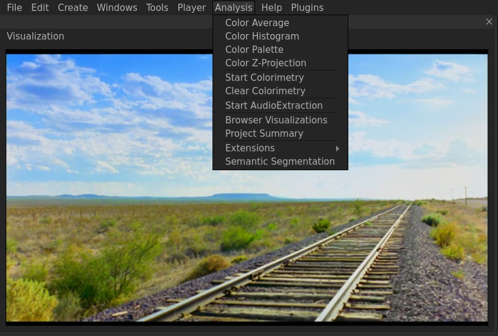
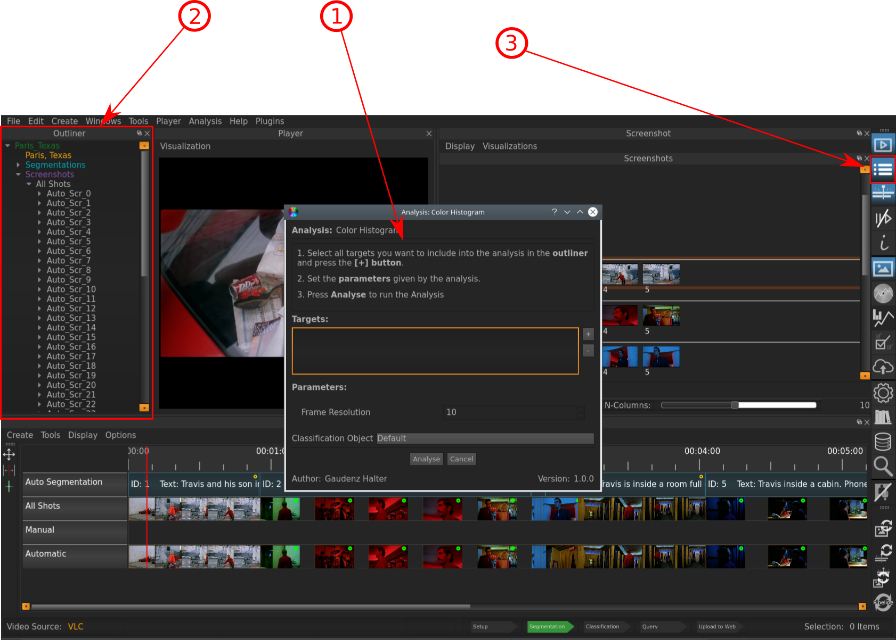
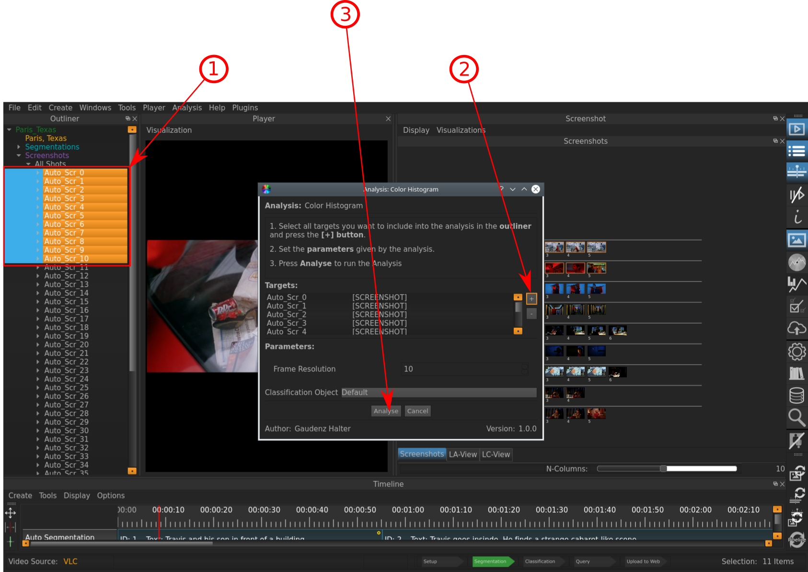
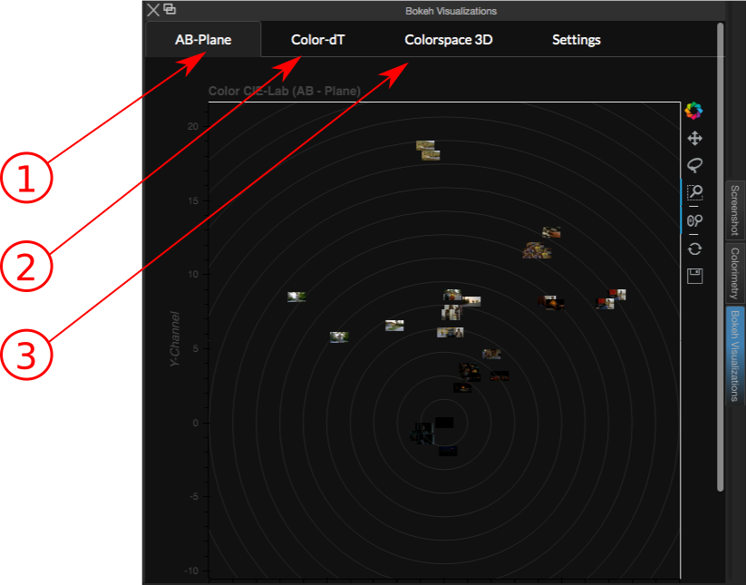

.. _analyses:

Analyses
===========

The Analyses Window lets you explore the different color properties of Entities like **Screenshots** and **Segments**. This is one of the most powerful Features that VIAN has to offer: You can run several analyses on entities in your project and inspect them in this widget.
Let's say you are interested in Color Histogram of the **Screenshots** you have taken so far in your project:

Running Analyses
----------------

In the header menu, click **Analysis**. The following dropdown menu will appear:

   
   The Analyses dropdown menu.

Select the analysis you want to carry out, in this case we said that we are interested in Color Histogram.
Once you clicked it, the following window will appear:

   
   The Entitie Selection Window.

In the Window **1**, the entities on which the anasyses are to be run are being displayed in the «Targets» field. Since you ran this the first time, the list is empty.
To add entities on which to perform the analyses, sekect them in the :ref:`outliner` **2**. If you haven't the Outliner open already, you can do this by selecting it from the toolbar **3**, or by pressing **ALT-O**.

   
   The Entitie Selection Window.

After selecting the intended Screenshots in the Outliner **1**, click **+** **2** to add them to the «Target» list.
To apply the analyses, click «Analyse» **3**.

Inspecting Analyses
-------------------

After you ran an analysis, you can inspect the computed result in the following way:

- The Color Histogram, the Color Palette, and the Color Z-Projection are visible in the respective element's :ref:`inspector`
- The Color Features are displayed in the **Analyses Widget**, where there are 3 different ways of plotting:

   
   The Interface with the Analyses Window after the Analyses were run.

Indicated Information:

- **1**: The first tab shows the selected items ploted in the AB-Plane
- **2**: The second tab displays the elements in the Color-dT, which plots the elements over time according to their saturation
- **3**: The third displaying is a 3-D plotting of the color features of the selected items

There can sometimes be problems when it comes to display these visualizations directly in VIAN, if these visualizations are not being displayed directly in VIAN, try Analysis >> Browser Visualizations to display them in the web browser.

* :ref:`genindex`
* :ref:`modindex`
* :ref:`search`

