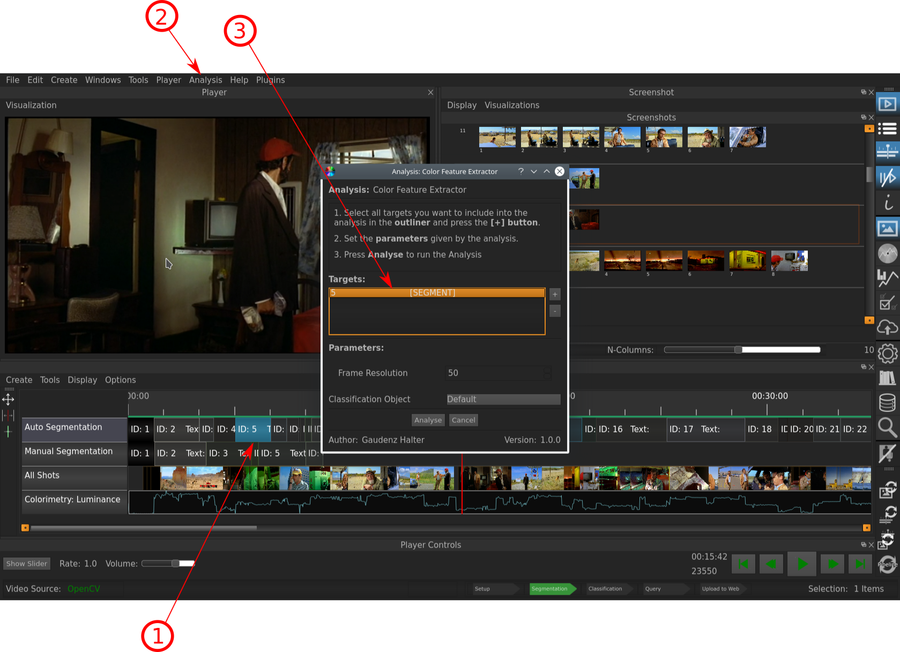

.. _analyses:

Analyses
===========

The Analyses Window lets you explore the following different color properties of Entities like **Screenshots** and **Segments**:

- Color Features
- Color Histogram
- Color Palette

To be able to view these properties in the Analyses Window, you have to select the element that you want to run the analyses on and select *Analysis* and then the respective analysis, e.g. *Color Features*. The appearing Mas will look something like in the following picture:

   
   The Analysis Mask that appears when analysis of an element shall be performed.

Indicated Information:

- **1**: The Segment, that was selected to analyze.
- **2**: The *Analysis* Button under which the different Analyses can be selected.
- **3**: The element on which the Analysis should be performed is again displayed (*note*: you have to actively select it again, so that the Analysis is performed)

.. figure:: analyses_segment_5.png
   :scale: 60%
   :align: center
   :alt: map to buried treasure
   
   The Interface with the Analyses Window after the Analyses were run.

Indicated Information:

- **1**: The Tabs indicating which Analyses have been run (in this case all three); the Color-Histogram being displayed.
- **2**: The Entity (in this case the Segment #5)  on which the Analyses were performed is selected (if another Segment on which no Analyses were performed was to be selected, the Analysis Window would be empty).
- **3**: The Cursor was manually dragged to a position in Segment #5 to get a Frame in the Video Player that corresponds more or less to the Analyses Window (*note*: this has to be done manually, the Cursor does not move to a Frame corresponding to the selected Entity automatically).

* :ref:`genindex`
* :ref:`modindex`
* :ref:`search`

