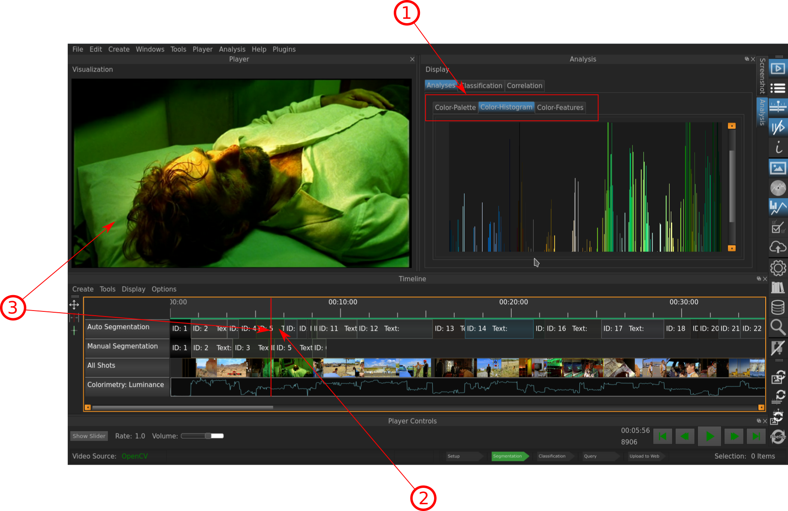

.. _analyses:

Analyses
===========

The Analyses Window lets you explore the different color properties of Entities like **Screenshots** and **Segments**. This is one of the most powerful Features that VIAN has to offer: You can run several analyses on entities in your project and inspect them in this widget.
Let's say you are interested in Color Histogram of the **Screenshots** you have taken so far in your project:

Running Analyses
----------------

In the header menu, click **Analysis**. The following dropdown menu will appear:

.. figure:: analyses_dropdown.png
   :scale: 60%
   :align: center
   :alt: map to buried treasure
   
   The Analyses dropdown menu.

Select the analysis you want to carry out, in this case we said that we are interested in Color Histogram.
Once you clicked it, the following window will appear:

.. figure:: analyses_select_entitites_marked.png
   :scale: 60%
   :align: center
   :alt: map to buried treasure
   
   The Entitie Selection Window.

In the Window **1**, the entities on which the anasyses are to be run are being displayed in the «Targets» field. Since you ran this the first time, the list is empty.
To add entities on which to perform the analyses, sekect them in the :ref:`outliner` **2**. If you haven't the Outliner open already, you can do this by selecting it from the toolbar **3**, or by pressing **ALT-O**.

.. figure:: analyses_selected_entitites_marked.png
   :scale: 60%
   :align: center
   :alt: map to buried treasure
   
   The Entitie Selection Window.

After selecting the intended Screenshots in the Outliner **1**, click **+** **2** to add them to the «Target» list.
To apply the analyses, click «Analyse» **3**.

Inspecting Analyses
-------------------

   
   The Interface with the Analyses Window after the Analyses were run.

Indicated Information:

- **1**: The Tabs indicating which Analyses have been run (in this case all three); the Color-Histogram being displayed.
- **2**: The Entity (in this case the Segment #5)  on which the Analyses were performed is selected (if another Segment on which no Analyses were performed was to be selected, the Analysis Window would be empty).
- **3**: The Cursor was manually dragged to a position in Segment #5 to get a Frame in the Video Player that corresponds more or less to the Analyses Window (*note*: this has to be done manually, the Cursor does not move to a Frame corresponding to the selected Entity automatically).

* :ref:`genindex`
* :ref:`modindex`
* :ref:`search`

