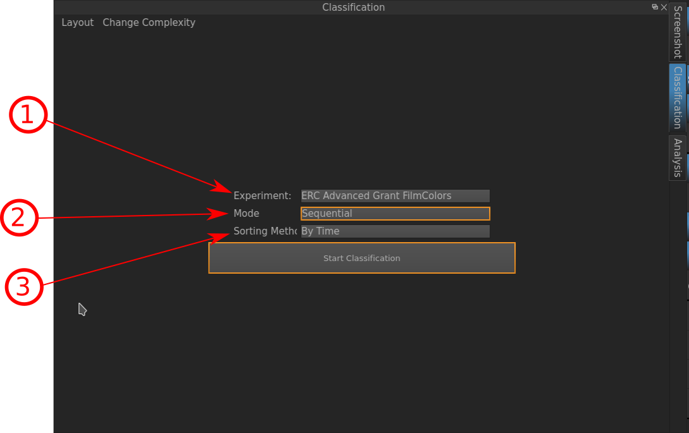
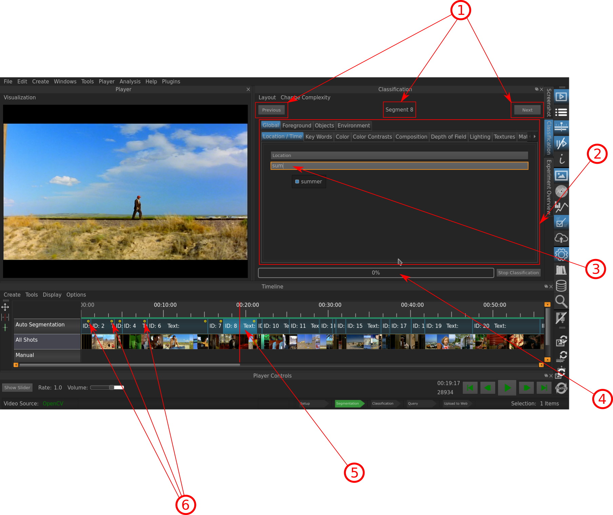

.. _classification:

Classification
==============

The Classification Window is the tool for annotating the Objects with the corresponfing Vocabulary you intend to. In order to be able to perform this task, you need to have two steps already have done:

- The :ref:`segmentation` of your movie and
- The Setting up of an :ref:`experiment`

   The Mask before starting a Classification.

Indicated Information:

- **1**: **Experiment**: Choose the experiment (i.e. the Vocabulary and Objects) you want to use to classify your movie. If you have not set up an Experiment yet you can define one HERE, or you can select the *ERC Advanced Grant FilmColors* (if you selected its template when starting a noew project) which already has Objects and a corresponding Experiment pre-defined.
- **2**: **Mode**: Select the Mode in which you want to carry out your Classification; which means, either you select the Segments manually (you click on them in the :ref:`timeline`), or you classify them sequentally (as seen in the image below).
- **3**: **Sorting Method**: TO DO

After you've specified the required Settings, you will be prompted with a screen that looks like the following for carrying out the Classification:

   The Classification in progress.

Indicated Information:

- **1**: The Button on the left *Previous* for going one Segment back, the button on the right *Next* for proceeding to the next Segment, the Indicator in the middle, on which Segment one is at the moment.
- **2**: The Area with the Objects and the Vocabulary to classify them. In this case, the *Global* Object is going to be classified with regard to its *Location* concept from the *Location/Time* Vocabulary.
- **3**: The *Location* concept is being searched for the term *summer*.
- **4**: The Progress Bar, indicating to what percentage the Classifiaction is done.
- **5**: The Segment one is at at the moment, the Cursor jumps automatically to its center, so a representative Frame of the Segment is displayed in the :ref:`video_player`.
- **6**: The yellow dots indicate that a segment has been classified.

* :ref:`genindex`
* :ref:`midindex`
* :ref:`search`
