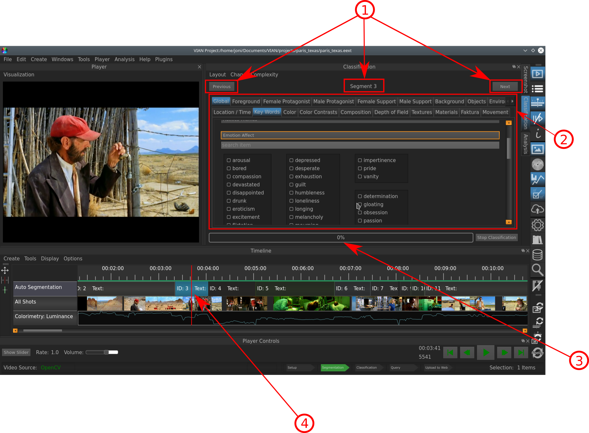

.. _classifiaction::

Classification
==============

.. figure:: classification_start.png
   :scale: 80 %
   :align: center
   :alt: map to buried treasure

   The Mask before starting a Classification.

   The Classification in progress.

Indicated Information:

- **1**: The Indicator at which Segment you are at the moment, and the Buttons for going to the previous and the nex Element, respectively.
- **2**: In this area you will find the Vocabulary that you set up in the **Experiment** Section: In the upper bar the defined Objects and their corresponding Concepts are selectable (as Tabs). In the area below are the actual Words from the Vocabulary with which the Objects are classified.
- **3**: The Progress Bar indicating how far you are in the process of classifying your movie.
- **4**: As you traverse your Segments, the current Segment is highlighted in blue and the Curser jumps automatically to the center of the Segment, so that a representative Frame is being displayed in the **player controls**.

* :ref:`genindex`
* :ref:`midindex`
* :ref:`search`
