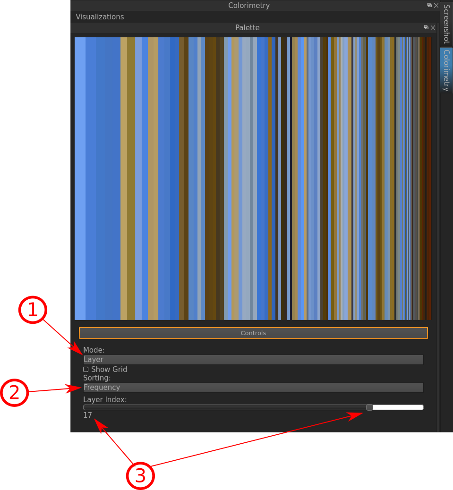
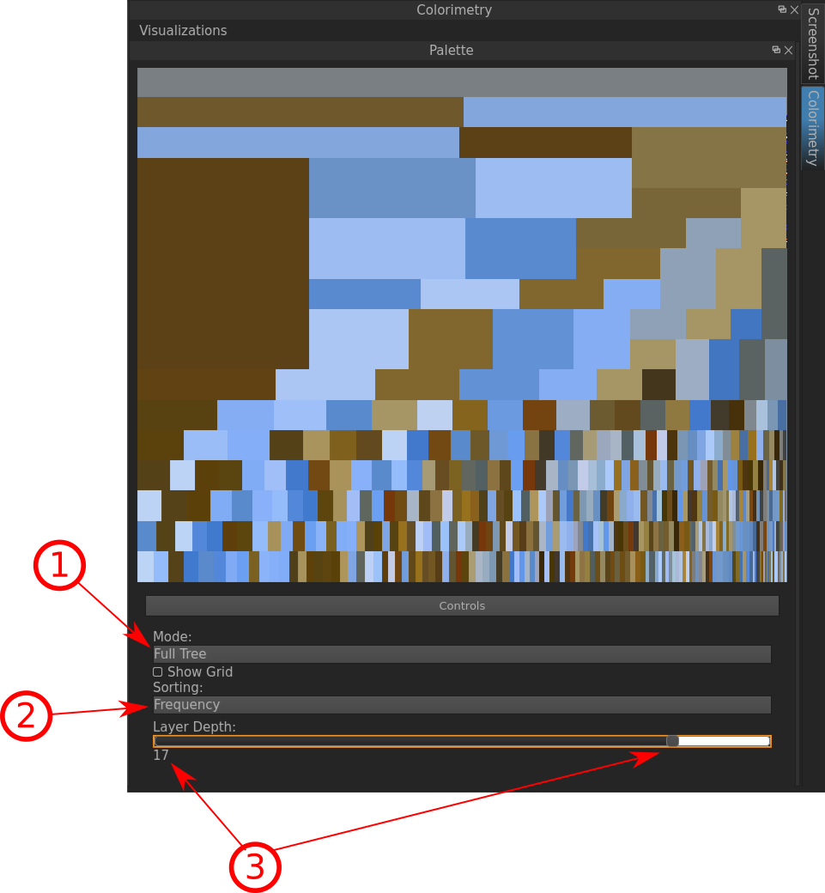

.. _colorimetry:

Colorimetry
===========

If you ran the **Colorimetry** (which means that the color features for each frame are being computed), you can inspect the color features of the current frame you are at in the **timeline**.

.. figure:: colorimetry.png
   :scale: 60%
   :align: center
   :alt: map to buried treasure
   
   The two visualizations of the Colorimetry along the corresponding frame.

Indicated Information:

- **1**: The **Palette**-Visualization of the current Frame.
- **2**: The **Space Palette**-Visualization of the current Frame.

   

   
Indicated Information:

- **1**: **Mode**:
 - *Full Tree*:
 - *Layer*:
- **2**: **Sorting**:
 - *Cluster*:
 - *Frequency*:
 - *Hilbert*:
- **3**: **Layer Depth**:

* :ref:`genindex`
* :ref:`modindex`
* :ref:`search`

