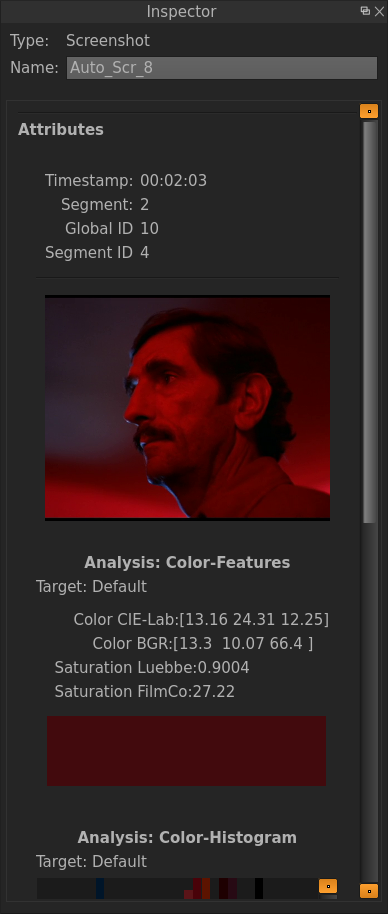

.. _inspector:

Inspector
=========

The Inspector is one of the most important Widgets of VIAN. It can be activated by **ALT-I** or via the menu bar. The Inspector is content-sensitive, meaning that it
adapts to the current selection. Most of the modifications regarding mate-information like the Title etc. to a specific item (i.e. a Segmentation, Segment,
Annotation, Screenshot, etc.) can be performed using the Inspector.

Depending on the selected item, the Inspector consists distinct parts, which are separated by black lines. If for example a Screenshot is selected, the Inspector looks as follows:

   The Inspector showing a Screenshot.

If a Segment is selected, the Inspector allows 

.. figure:: inspector_segment.png
   :scale: 80 %
   :align: center
   :alt: map to buried treasure

   The Inspector and its field when a Segment is selected.

* :ref:`genindex`
* :ref:`modindex`
* :ref:`search`
