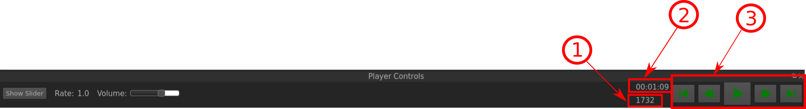

Player Controls
===============

The Player Controls Window is a straight-forward tool:

   The Player Controls of VIAN.

Indicated Information:

- **1**: The number of the Frame that you are actually at in the **Timeline**.
- **2**: The exact Time where you are (hh:mm:ss) at in the **Timeline**.
- **3**: Controls for jump to the beginning of the movie, fast backward, play/pause, fast forward and jump to the end of the movie.

* :ref:`genindex`
* :ref:`modindex`
* :ref:`search`

