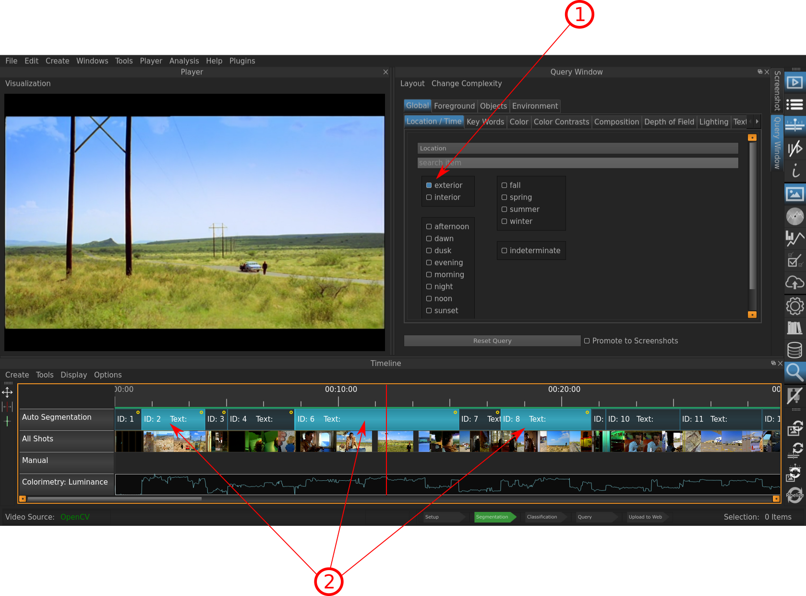

.. _query:

Query
=====

Often you want to review your annotated project: Which Segments are annotated with which Keywords? The Query Interface lets you do this easily. You simply select the Keywords you are interested in, and the corresponding Segments are hghlighted in the :ref:`timeline`.

   
   The query interface with the keyword "exterior" for "Location/Time"being selected.

Indicated Information:

- **1**: The :ref:`vocabulary` interface with the Objects and the corresponding Vocabularies and Keywords.
- **2**: All annotated Segments (the ones marked with the yellow dot) that have been tagged with the selected Keyword are highlighted with blue.

* :ref:`genindex`
* :ref:`modindex`
* :ref:`search`

