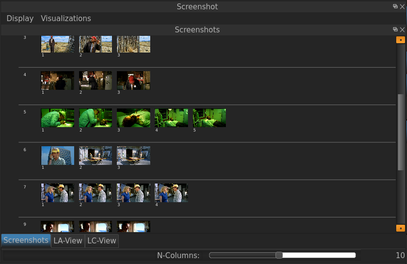
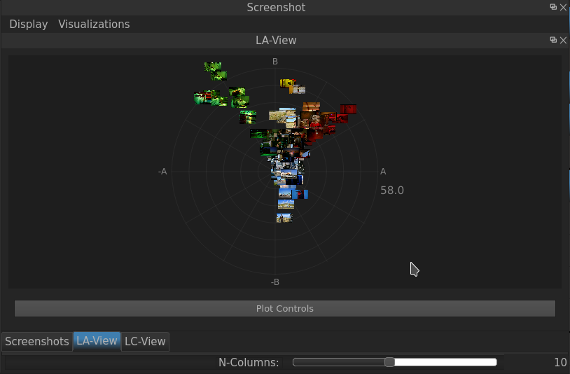

.. _Screenshot Manager:

Screenshot Manager
==================

The Screenshot Manager window allows the user getting an overview of the Screenshots taken so far. In the default Tab «Screenshots», the Screenshots are listed according to the Segment in which they've been taken - this can be very handy as it allows getting a quick overview over the color consistency of the Segments.

   The Screenshot Manager of VIAN. The Screenshots are grouped to the Segments in which they've been taken.

If the **Pipeline** Analyses of the Screenshots has been run, one can plot them according to two different color analyses:

   The LA-View of the Screenshots taken.

* :ref:`genindex`
* :ref:`modindex`
* :ref:`search`

