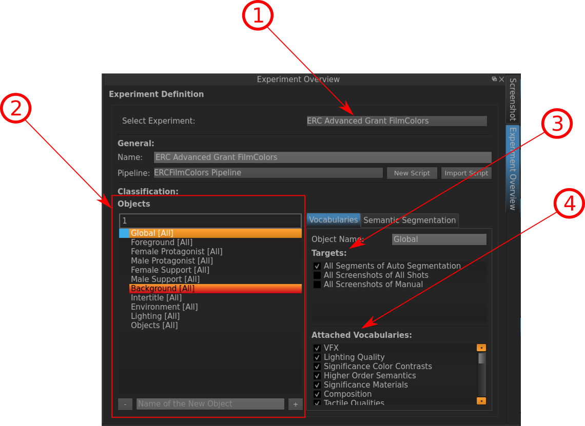

.. _setup:

Setup
=====

The Setup window displays the Experiment Overview of the current Project. I.e. in it is definable which :ref:`experiment` with which :ref:`vocabulary` on which objects (e.g. :ref:`screenshot`) you want to run. Generally, you would do such a task rather during the **Setup**-step of your project.

Indicated Information:

- **1**: The :ref:`experiment` with which you want to carry out the :ref:`classification`.
- **2**: The Object defined in the selected Experiment. Select one (e.g. "Global") to define the Targets on which you want to classify this Object (**3**) and the Vocabularies you want to use therefore (**4**). 
   
* :ref:`genindex`
* :ref:`modindex`
* :ref:`search`

