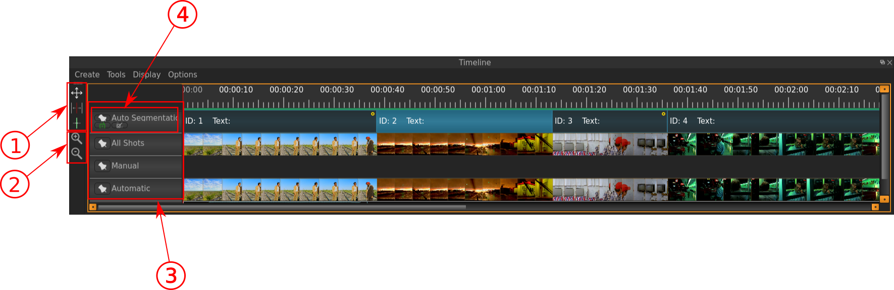
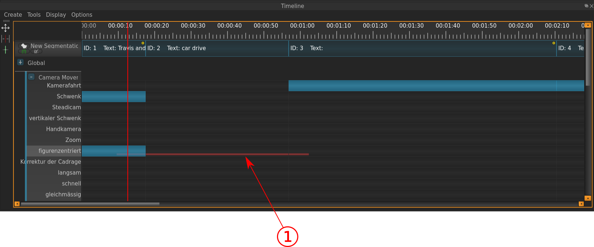
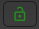
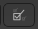
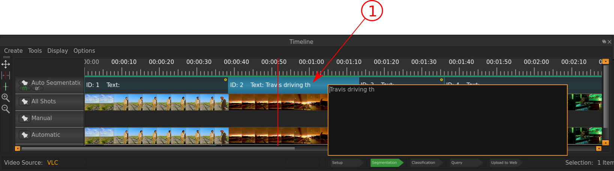
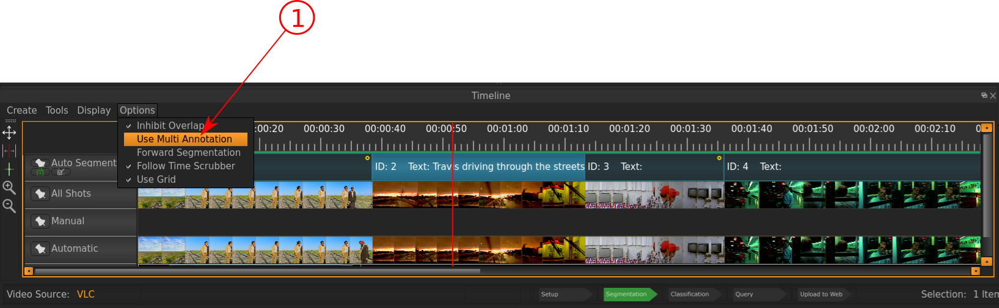
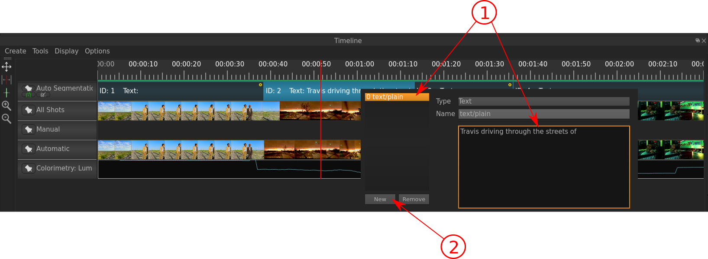
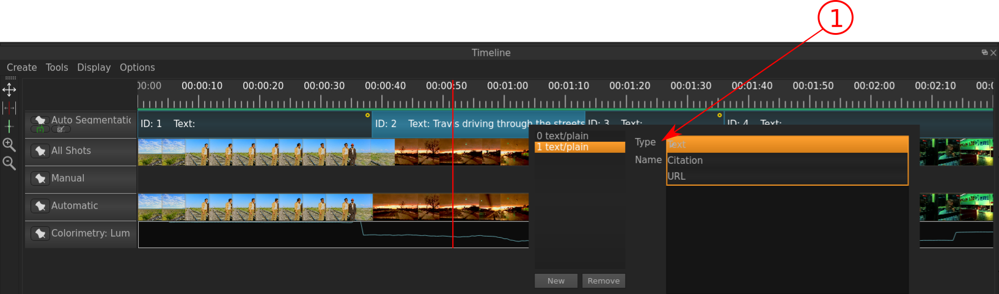

.. _timeline:

Timeline
========
The Timeline is used for all modifications of the VIAN project that is directed to time-dependent entities and as such
the a major component of the UI.
Use the Timeline to create and modify **Segments** and **Segmentaion-** and **Screenshot-** Layers.

   The Timeline of VIAN.

Indicated in the image above are:

- **1**: Tools for manipulating Segmentations resp. Segments:
 - The Selection Tool |selection_tool| is simply for selecting a Segment, to e.g. view its properties in the **Inspector** or moving its bounderies. Tip: to move the bounderies of both adjoining segments, press SHIFT and move then the border.
 - The Splitting Tool |splitting_tool| is for splitting a existing Segment apart, e.g. when you realize that a Segment isn't coherent regarding its colorpattern. As you move the Splitting Tool over the Segment, you see in the **Player** at which frame you are at, so you can split the Segment right away at the correct point, so you don't have to adjust it afterwards.
 - The Merging Tool |merging_tool| is for merging two Segments into one, this is typically necessary after you did an auto-segmentation.
- **2**: Buttons for zooming in and out of the Timeline (also possible with shortcut CTRL + Scroll).
- **3**: The different Layers that are being displayed in the Timeline: On the image above there is one Segmentation-Layer - **4** - and three Screenshot-Layers, where the first one shows all Screenshots, the second layer shows the one taken by hand, and the third one shows the ones that were automatically generated.
- **4**: Below the Segmentation Layer are the clickable icons for two useful tools:
 - The locking Tool |lock_tool| is for disable the possibility of changing the segmentation - if it is red, you cannot manipulate Segments.
 - The Classifying Tool |classify_tool| is useful if you want to quickly classify in the timeline certain Segments - this is espacially handy if you want to classify several successive Segments with the same Tag (see image below), which is more cumbersome using the :ref:`classification` widget.

   The Classification inside the Timeline of VIAN.

The red bar **1** was achieved by clicking «figurenzentriert» for Segment 1 and then dragging on the level of «figurenzentriert» into Segment 3.
When the mouse click is released, all Segments under the red line become annotated with this Tag.

.. |selection_tool| image:: timeline_selection_tool.png
   :height: 20px
   :width: 20px

.. |splitting_tool| image:: timeline_splitting_tool.png
   :height: 20px
   :width: 20px

.. |merging_tool| image:: timeline_merging_tool.png
   :height: 20px
   :width: 20px

Adding Descriptions to Segments
-------------------------------

To add descriptions or notes to a Segment, double-click it, and insert the text you intend to.

To add multiple descriptions to Segments, enable it under Options >> Use Multi Annotation.

If you now double-click a Segment, you'll find an already added description under «0 text/plain» (arrow **1**).
To add further descriptions, click «New» (arrow **2**).

A new entry in the list to the left will appear.
Here you can insert your second description for this Segment.
You can also specify the MIME-type of your description or annotation (Text, Citation, URL).

* :ref:`genindex`
* :ref:`modindex`
* :ref:`search`
