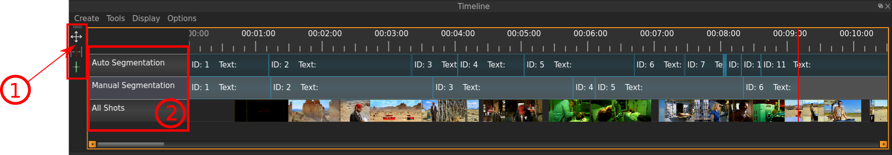
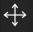
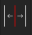

Timeline
========
The Timeline is used for all modifications of the VIAN project that is directed to time-dependent entities and as such
the a major component of the UI.
Use the Timeline to create and modify **Segments** and **Segmentaion-** and **Screenshot-** Layers.

   The Timeline of VIAN.

Indicated in the image above are:

- **1**: Tools for manipulating Segmentations resp. Segments:
 - The Selection Tool |selection_tool| is simply for selecting a Segment, to e.g. view its properties in the **Inspector** or moving its bounderies.
 - The Splitting Tool |splitting_tool| is for splitting a existing Segment apart, e.g. when you realize that a Segment isn't coherent regarding its colorpattern. As you move the Splitting Tool over the Segment, you see in the **Player** at which frame you are at, so you can split the Segment right away at the correct point, so you don't have to adjust it afterwards.
 - The Merging Tool |merging_tool| is for merging two Segments into one, this is typically necessary after you did an auto-segmentation.
- **2**: The different Layers that are being displayed in the Timeline: On the image above there are two Segmentation-Layers - the active one is the bluish one, inthis case the «Manual Segmentation» - and one Screenshot-Layer, where all Screenshots, whether they were automatically or manually created, are being displayed.

* :ref:`genindex`
* :ref:`modindex`
* :ref:`search`
