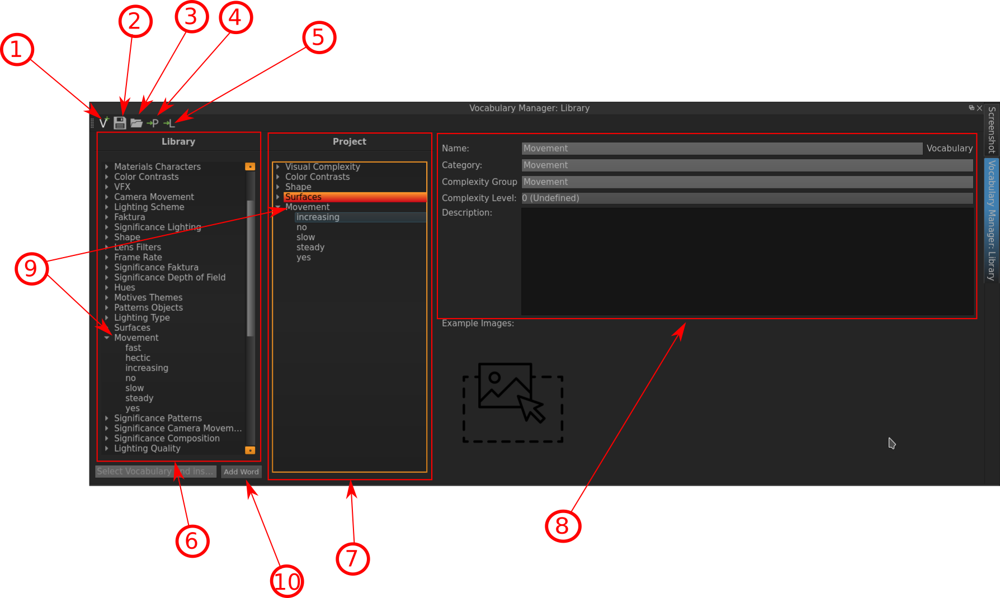

.. _vocabulary::

Vocabulary
==========

The Vocabulary Tool is a core Feature in VIAN. It is designd to be as flexible as possible to be able to annote with exactly the Vocabulary you need.

When you install VIAN, it comes equipped with a default Vocabulary library. It consists of various Categories with corresponding Terms (e.g. there are Categories for filming Techniques like *Camera Movement* with can be described by Terms like *yes*, *no*, *steady* etc.). Since often you need a specific Vocabulary for your project, it wouldn't be useful or handy to have this huge Vocabulary and only use a little subset of it. So, what you do instead, is creating a specific Vocabulary for you **Project** (in the image below you can see this division indicated by the numbers **1** and **2**): You select the Categories you need from the Library and put it into your project Vocabulary by clicking the «P»-Button (indicated in the image below by **4**).

If you have a Category in mind for your project that you don't find in the Library, you can create it yourself and specifiy the corresponding Terms. You do this by either clickng the «V»-Button (indicated in the image below by **1**), or right-clicking into the Library-Field (indicated in the image below by **6**) and selecting «New Vocabulary». The newly created Vocabulary will appear at the end of the Library list. Rename it by either double-clicking or specifiying the «Name»-Field indicated in the image below by **8**. You can add Terms to your Vocabulary by clicking the Button «Add Word» (indicated in the image below by **10**).

    The Classification in progress.

Indicated Information:

- **1**: Create a new Vocabulary Category.
- **2**: Save Vocabulary.
- **3**: Open Vocabulary from File.
- **4**: Add Vocabulary Category (with corresponding Terms) from Library to Project. 
- **5**: Add Vocabulary Category (with corresponding Terms) from Project to Library (this will result in overwriting the Category in the Library with the Category from the Project, e.g. if you removed Terms from the Category in th Project Window and add it back to the Library, the Category in the Library will also no longer have that Term).
- **6**: The Library Vocabulary.
- **7**: The Project Vocabulary.
- **8**: The Information Window which displays Information of the selected Category.
- **9**: In both windows, *Library* and *Project*, the Category *Movement* is selected. Since the movie that is gonna be annoted has rather slow camera movement, the terms *fast* and *hectic* were removed from the Project Vocabularyfrom the Project Vocabulary since they are not gonna be used.

* :ref:`genindex`
* :ref:`modindex`
* :ref:`search`
