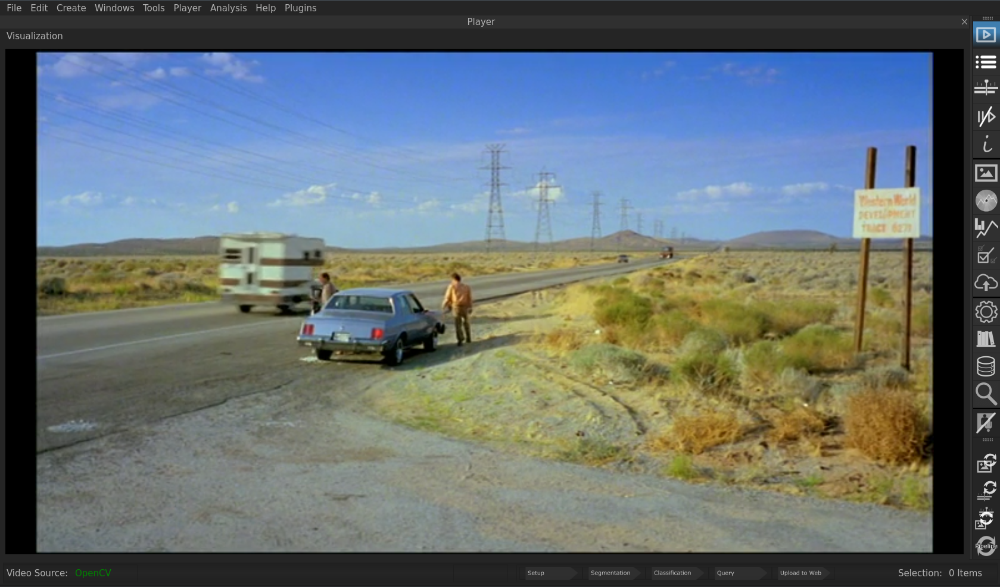
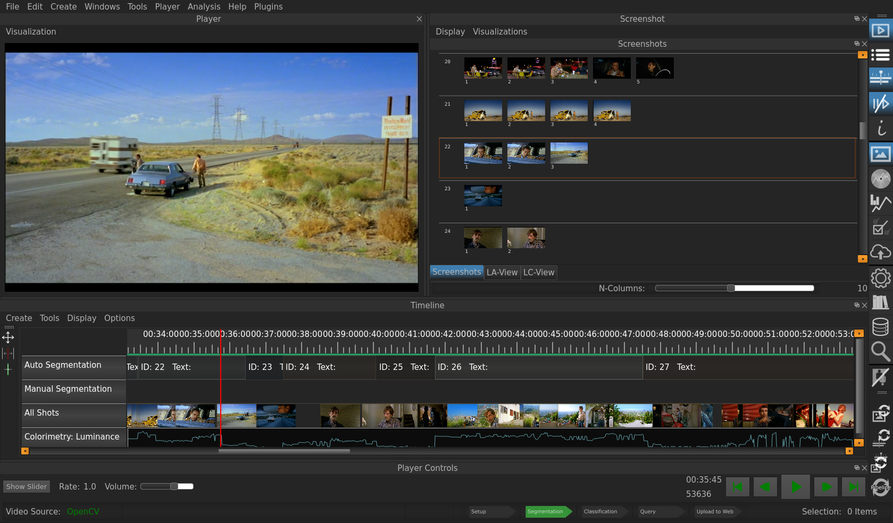
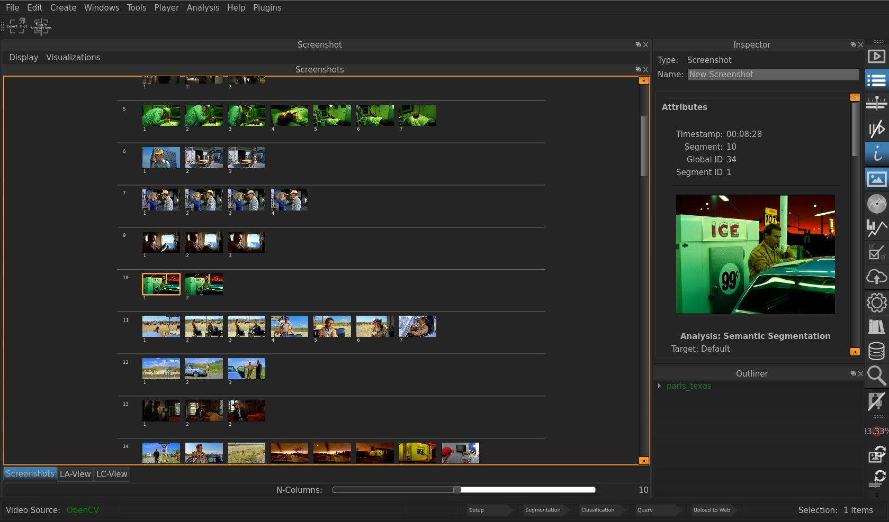
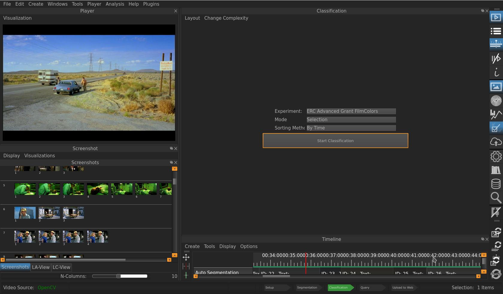
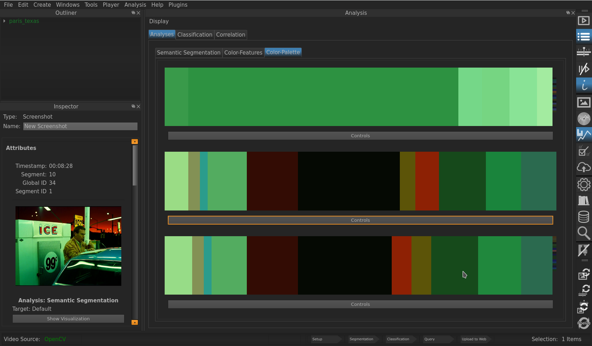

.. _perspectives:

Perspectives
============
VIAN uses **Perspectives** to give you the necessary tools for a specific step of your workflow. You can think of it as predefined Window-Configurations: Suppose, for example, you wanted to get an overview over the screenshots you've taken sofar. Instead of manually deactivating Windows you don't need for that (e. g. the **Player Controls** etc.) and activating the ones which would be helpful (e. g. the **Inspector** etc.), you would simply hit **ALT+4** and go into the **Screenshot Perspecitve**, where there are the relevant Windows pre-defined.

Currently, there are six Perspectives implemented in VIAN which can be selected with **ALT-1 (2, 4, 5, 6, 7)**.
each of these have a distinct purpose.

.. toctree::
   :maxdepth: 4

   perspectives.rst 
   
Player Perspective (ALT+1)
**************************

The Player Perspective removes all UI-Elements, allowing to have the full screen displaying the
current movie.

   The Player Persepctive.

Standard Perspective (ALT+2)
**************************

The Standard Perspective rearranges all the elements to the state when the program is started.
*Timeline*, *Outliner*, *Inspector* and the Toolbars.

   The Standard Perspective.

.. Annotation Perspective (ALT+3)
.. ******************************
.. The Annotation Perspective displays all necessary widgets for *Segmenting* and *Annotating* a film, including the
.. *Timeline*, *Outliner*, and the Toolbars.

Screenshot Perspective (ALT-4)
******************************
The Screenshot Perspective shows all screenshots token so far in a big window on the left side, on the right sight are thi *Inspector* and *Outliner* modules.

   The Screenshot Perspective.

Classification Perspective (ALT-5)
**********************************
The Classification Perspective focuses on the classification widget including the *Timeline* on the right side, while on the left are the *video-Player* and the *Screenshot* widget.

   The Classification Perspective.

Analysis Perspective (ALT-6)
****************************
The Analysis Perspective provides the widgets used for analysing the colors of a selected entity (e.g. sreenshot etc.), which is being displayed in the *Inspector* beneath the *Outliner* on the left.

   The Analysis Perspective.

* :ref:`genindex`
* :ref:`modindex`
* :ref:`search`
