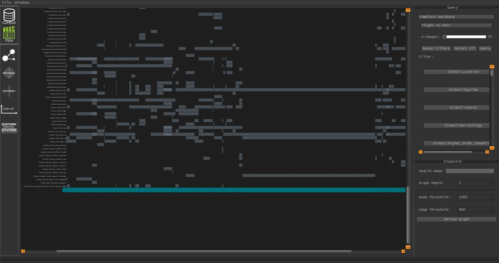

VIAN 0.5.0
==========

**READ THIS**

Automatic Segmentation
**********************

VIAN can now automatically generate Segmentations based on Color-Features, using Agglomerativ Clustering.
For more information read here: :ref:`auto_segmentation`

Merging Segments
****************
Cutting Segments has already been introduced in 0.4.7, by now,
merging Segments can be performed in the Timeline as well.

In combination with the **Automatic Segmentation**, the Segmentation Workflow can now be changed.
Starting off with creating an automatically generated Segmentation, and manually correcting it using the
**Merge** and **Cut** Tool.

For more information, read here: :ref:`merging_segments`

.. figure:: cutting_segments_02.jpg
   :scale: 80 %
   :align: center
   :alt: map to buried treasure

Importing Screenshots
*********************
Since VIAN uses the exact Frame Positions of Screenshots frequently, the import of Screenshots had been missing for quite a
while due to the problems that arise from finding a Screenshot in a complete film.

With 0.5.0 VIAN does now offer to import Screenshots into an existing Project. The Pixel-Size of the Screenshots does not
have to match the Movie Size.

Feature Plots
*************
The FilmColors Visualizer does now implement the **Feature Plot**, which might give useful insights about the
distribution of Keywords in one film.

Sub Corpora
***********
It is now possible to create Sub Corpora in the FilmColors Visualizer, filter out the films which are not selected.
You can find the CorpusManager in the FilmColors Visualizer in **Windows/CorpusManager**.

Extensive List
**************
* See Github

Hot-Fixes
*********
* OSX Error in Streaming solved (0.4.6)
* Checking Project integrity on Start-Up (0.4.7)

* :ref:`genindex`
* :ref:`modindex`
* :ref:`search`