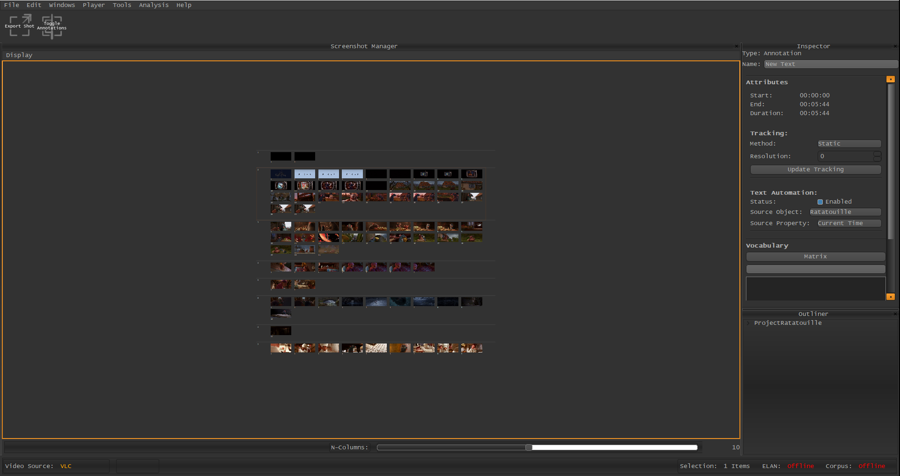

VIAN 0.4.2
==========

VIAN 0.4.2 is out, with many new and improved tools.
To make the change as easy as possible for you, **here** are the **most important changes** to note.

Perspectives
************
Since VIAN is now also capable of segmenting a movie, a new perspective called **Segmentation** has been added.
While Windows users can already customize their interface freely, this is not yet possible on OSX due to a bug in
libVLC. Since most of the windows are only rarely used in a specific section of the Workflow,
many windows have been hidden, to increase the size of the player and the timeline.

Remember that all Windows can be opened using the *Window/ Menu* on the very top.

The perspectives are now mapped as follows:

.. note:: **Keyboard Mapping**

    * Alt + 1: Player

    * Alt + 2: Segmentation

    * Alt + 3: Annotation

    * Alt + 4: Screenshot Manager

    * Alt + 5: Node Editor

.. figure:: persp_player.png
   :scale: 50 %
   :align: center
   :alt: map to buried treasure

   Player Perspective

.. figure:: persp_segmentation.png
   :scale: 50 %
   :align: center
   :alt: map to buried treasure

   Segmentation Perspective

.. figure:: persp_annotation.png
   :scale: 50 %
   :align: center
   :alt: map to buried treasure

   Annotation Perspective

   Screenshot Perspective

.. figure:: persp_nodeditor.png
   :scale: 50 %
   :align: center
   :alt: map to buried treasure

   Node Editor Perspective

.. note:: **Keyboard Mapping Windows**
   To further improve the fast changing of current windows,
   one may use the new Hotkeys to toggle specific Windows:

   1. Ctrl + O: Outliner

   2. Ctrl + I: Inspector

   3. Ctrl + P: Screenshot Manager

   4. Ctrl + T: Timeline

Changing the Video-Source
*************************
Depending on the movie file you're currently using and on how fine-grained your work in the timeline has to be,
VLC might not give a sufficient frame-update rate. (You may only see one or two frames of a given second when sliding
thought the movie)

To counter this problem, VIAN gives you the ability to ready every frame out of the movie.
With 0.4.2, you now have the possibility to switch fast between those system by clicking on the **Video Source Field**,
on the bottom-left corner of VIAN.
You can now choose between three different options:

    1. **Always VLC** will use VLC to read the current frame when scrubbing though a movie.
    2. **Always OpenCV** will use OpenCV to read the current frame.
    3. **Timeline Scale Dependent** when you have zoomed out relatively far on the Timeline VLC will be used,
        if your time magnification is relatively high, OpenCV will be used.

.. figure:: source_selection.png
   :scale: 50 %
   :align: center
   :alt: map to buried treasure

   Selecting the Video Source in VIAN.

Annotation are Time-Independent from their Layer
************************************************

Until now, an Annotation has been part of an Annotation-Layer, which itself had a start and an endpoint.
This has always been a confusing and impractical concept and has now been changed.

In VIAN 0.4.2, Annotations have their own start end endpoint. Layers only control the visibility of the Annotations
which can be toggled with a **right mouse-click/Hide Layer** in the Timeline.

.. figure:: annotations.png
   :scale: 70 %
   :align: center
   :alt: map to buried treasure

   The new look of the Timeline with each Annotation having it's own bar.

Extensive List
**************
   * PlayerControl: has now Image based buttons to improve the look.

   * Timeline: Slider can no longer pass the begin or end of the movie.

   * Timeline: jumps to the next time frame when the slider reaches the end of the current time-in-view.

   * Timeline: Small Time indicator is shown when using the Slider. This can be turned of in Timeline/Display/

   * ScreenshotExport: Indicating Quality percentage now.

   * ScreenshotManager: Zooming should now work reliably

   * ScreenshotManager: Ctrl + A for selecting All

   * ScreenshotManager: Show a Loading Sign during loading of Screenshots

   * ScreenshotManager: Slider is deactivated when the Arrangement is dynamic to avoid confusion.

   * Timeline: When no Project is Open, the Timeline is not active.

   * PlayerControls: When no Project is Open, the Controls are disabled.

   * OpenCV per Frame is now moved in it's own thread.

   * FPS is now collected by OpenCV as it is more reliable especially before the User has played the movie.

   * Annotation and Segmentation Perspectives

   * Rearranging the Windows in the perspectives

   * Automated Text Annotations by any data from the Project

   * Analysis: MosaicPlot added.

   * Welcome Window is now in the Documentation

   * OpenCV Frame is now in the Background of the Annotations

   * Annotations are not shown in the Segmentation Perspective

   * Numpy and Pickle implementation for Async Loading and Saving of large data

   *

* :ref:`genindex`
* :ref:`modindex`
* :ref:`search`